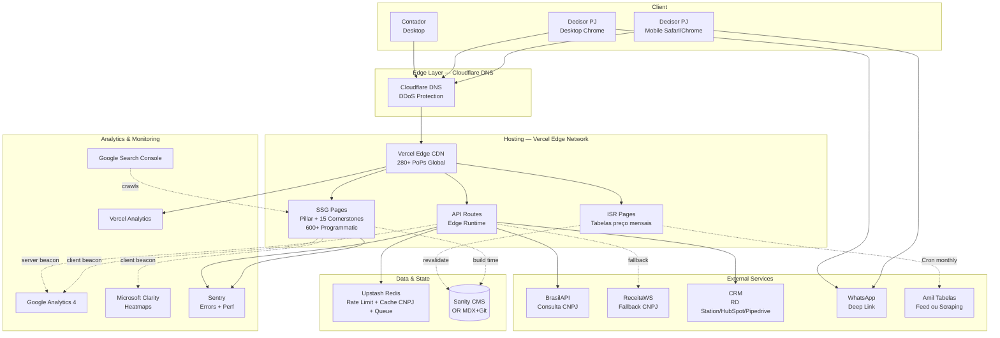
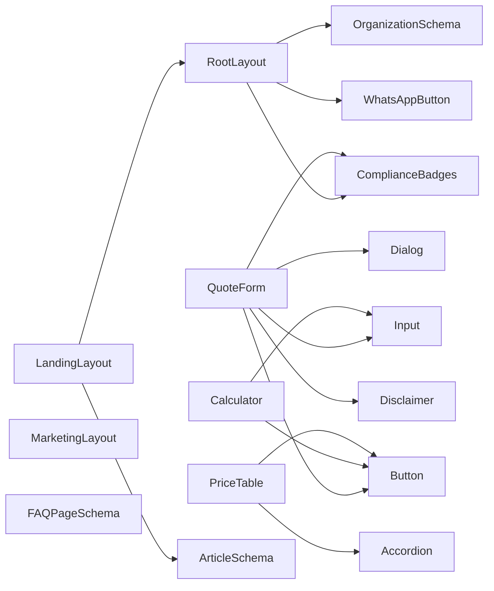
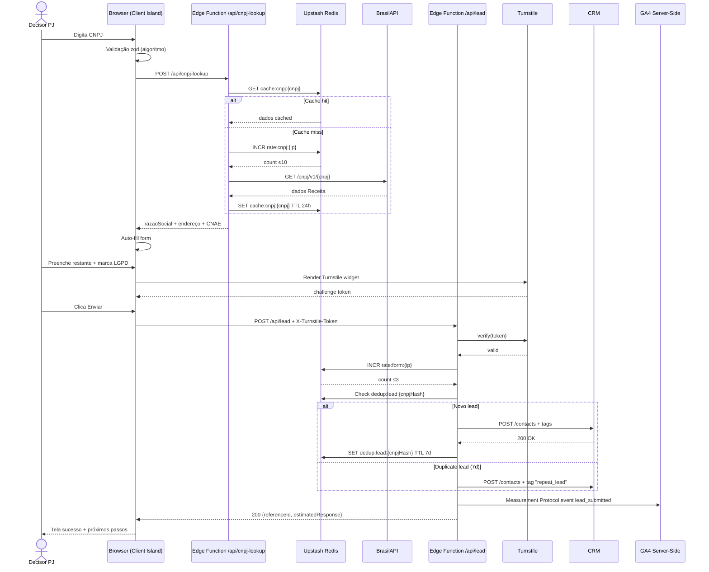
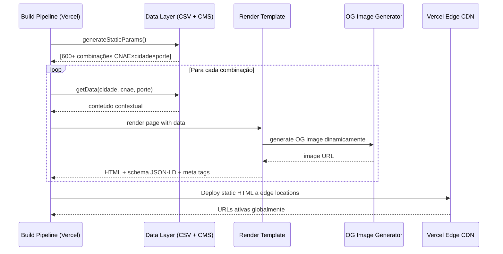
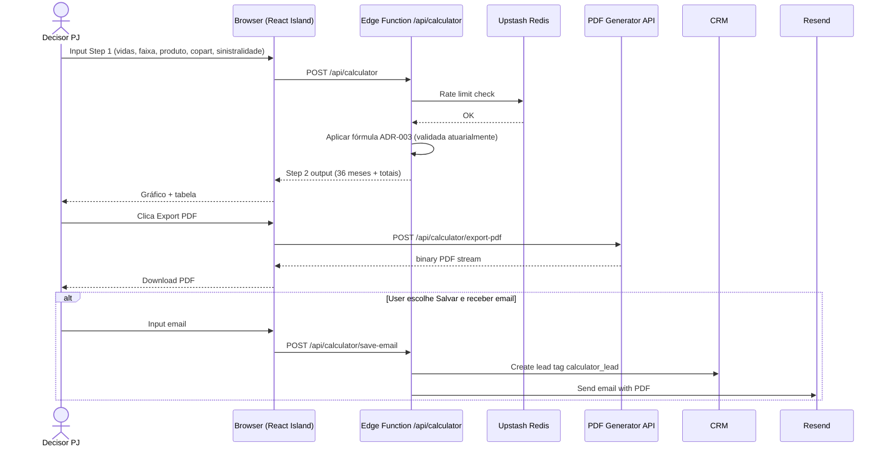

# planoamilempresas.com.br — Fullstack Architecture Document

**Documento:** Fullstack Architecture v1.1
**Projeto:** planoamilempresas.com.br
**Autor:** Aria (Architect — Visionary ♐) — Synkra AIOS
**Data:** 2026-04-16 (v1.0) → **2026-04-26 (v1.1)**
**Stack confirmada:** Next.js 14 App Router + Vercel + Upstash Redis + **Sanity v3** (CMS) + **Clint** (CRM)
**Status:** **v1.1 — APPROVED PARA REVALIDAÇÃO @po** (incorpora 7 mudanças do architect-checklist Story 1.0)

---

## Introduction

Este documento descreve a **arquitetura fullstack completa** do `planoamilempresas.com.br` — site de captação de leads B2B para plano de saúde Amil empresarial, operado por corretor autorizado SUSEP. A arquitetura unifica preocupações de frontend e backend em um único stack coeso baseado em **Next.js 14 App Router**, servindo como fonte única de verdade para desenvolvimento AI-driven.

O documento é direto consequência do **pivot arquitetural v1.2** (documentado em `docs/sprint-change-proposal.md`), que moveu o projeto de Astro + Cloudflare Pages para Next.js + Vercel via fork de codebase Next.js pré-existente do stakeholder (originalmente Bradesco Saúde Empresarial, agora com strip completo e reescrita para Amil — ver Story 1.1 do PRD).

### Starter Template or Existing Project

**Status:** **Fork de projeto existente** (não greenfield puro)

- **Projeto base:** `C:\Users\benef\Desktop\amil-saude\` (nome enganoso — `package.json name: "bradesco-saude-empresarial"`)
- **Autoria:** stakeholder é autor único (sem restrições de IP)
- **Escala herdada:** 1.005 páginas programáticas funcionais (27 estados × 742 cidades × 149 segmentos PDV × 44 segmentos BS × 15 produtos)
- **Reuso:** patterns (rate limiting, forms, route groups, SEO audit script), estrutura App Router, componentes Radix + Tailwind
- **Descartado:** 100% do conteúdo Bradesco (Story 1.1 faz strip completo)
- **Decisão preservada:** stack Next.js 14, App Router, Vercel, Upstash, Radix UI, Tailwind, Vitest (confirmadas)
- **Decisões já tomadas (Story 1.0, 2026-04-24):** CMS = **Sanity v3** (ADR-001 Accepted), CRM = **Clint** (ADR-002 atualizado), DNS strategy (ADR-004), Programmatic SEO Depth (ADR-005 v1.1)
- **Decisões pendentes:** spike técnico Clint API (Story 1.0c — bloqueia 4.3), validação atuarial fórmula calculadora (ADR-003 — bloqueia 6.3)

### Change Log

| Date | Version | Description | Author |
|------|---------|-------------|--------|
| 2026-04-16 | 1.0 | Draft inicial — fullstack architecture consolidada pós-pivot Next.js | Aria (Architect) |
| 2026-04-26 | 1.1 | Pós architect-checklist (Orion 2026-04-24): 7 mudanças incorporando realidade do produto descoberta na Story 1.0 — nomenclatura produtos Bronze→Platinum Mais com QC/QP/coparticipação%, NetworkProvider real (10 redes Power BI + tipo inferido), ClintAdapter, ADR-001 Accepted Sanity, ADR-005 NOVO Programmatic SEO Depth Strategy, seção Build Performance NOVA | Aria (Architect) |

---

## High Level Architecture

### Technical Summary

O sistema adota **JAMstack serverless** via **Next.js 14 App Router** com predominância de **Static Site Generation (SSG)** para páginas de conteúdo (pillar, cornerstones, 600+ landings programáticas), **Incremental Static Regeneration (ISR)** para tabelas de preço atualizáveis mensalmente, e **React Server Components (RSC) + Client Islands** para interatividade pontual (formulário, calculadora, busca de rede). O backend é composto por **Next.js API Routes com Edge Runtime** para proxy de serviços externos (BrasilAPI, CRM, PDF generation) e integra **Upstash Redis** serverless para rate limiting, cache de CNPJ e queue de fallback para CRM indisponível. A infraestrutura é **Vercel** nativo (edge network global 280+ PoPs, preview deploys automáticos, env vars por ambiente), com **Cloudflare DNS** opcional para camada adicional de DDoS protection. Esta arquitetura alcança os objetivos do PRD de **Lighthouse ≥92**, **Core Web Vitals "Good" em 95% das páginas**, **time-to-market acelerado** (via fork) e **E-E-A-T + compliance LGPD/ANS/SUSEP** implementados desde o dia 1.

### Platform and Infrastructure Choice

**Platform:** **Vercel** (host nativo Next.js) + **Upstash** (Redis serverless) + **Cloudflare** (DNS + opcional WAF)

**Key Services:**
- **Vercel Pages + Edge Network** (hosting + CDN)
- **Vercel Build Pipeline** (SSG/ISR generation)
- **Next.js API Routes + Edge Runtime** (BFF layer)
- **Upstash Redis** (rate limit, cache, queue)
- **Cloudflare DNS** (DDoS mitigation + DNS management)
- **Sentry** (errors + performance monitoring)
- **GA4 + Microsoft Clarity + Vercel Analytics** (analytics tri-layer)
- **BrasilAPI (primary) + ReceitaWS (fallback)** (consulta CNPJ)
- **Sanity v3** (CMS — ADR-001 Accepted Story 1.0)
- **Clint CRM** (CRM primário MVP — ADR-002 atualizado Story 1.0; backup: RD Station / HubSpot / Pipedrive como adapters)

**Deployment Host and Regions:**
- **Produção:** Vercel Edge Network global (automaticamente distribui; performance otimizada para Brasil via PoPs GRU, GIG)
- **Preview:** Vercel Preview Deploys (URL única por PR)
- **Development:** Local (`npm run dev`) + preview deploys para validação de stakeholder

**Rationale:**
- Next.js 14 é nativo Vercel (zero tuning extra para build/deploy)
- Upstash Redis é serverless, free tier generoso para MVP (10K commands/day), já validado no clone forkado
- Cloudflare DNS preserva opção futura de migração de hosting se necessário (vendor lock-in baixo)
- Custo inicial R$ 0-100/mês (free tiers); upgrade escalonado conforme volume

### Repository Structure

**Structure:** Monorepo simples (single Next.js app)
**Monorepo Tool:** Não necessário (Turborepo/Nx overhead injustificado para single app)
**Package Organization:** Single `package.json` na raiz

**Rationale:** Projeto é um único web app. Adicionar Turborepo/Nx cria complexidade sem ganho. Se no futuro adicionarmos app mobile nativo ou API pública standalone (Phase 2 — API de cotação moonshot), aí sim avaliamos Turborepo.

### High Level Architecture Diagram



### Architectural Patterns

- **JAMstack Architecture:** SSG predominante + ISR para conteúdo dinâmico + serverless APIs pontuais — _Rationale:_ Maximiza Core Web Vitals (pré-renderização), minimiza superfície de ataque (sem servidor de origem), aproveita CDN global do Vercel para latência baixa em todo Brasil.

- **React Server Components First, Client Islands Only When Needed:** Preferir RSC (zero JS shipped) e ilhas client apenas para interatividade essencial (form, calculator, whatsapp, network search) — _Rationale:_ Minimiza bundle size (NFR2 ≤100KB), melhora LCP/INP, reduz custo de hidratação, alinhado com arquitetura App Router moderna.

- **Adapter Pattern (CRM Integration):** Interface abstrata `CRMAdapter` com implementações específicas (RDStation, HubSpot, Pipedrive) — _Rationale:_ Permite trocar de CRM sem refatoração massiva; decisão de CRM pode ser revertida/mudada em Phase 2 sem impacto em código de domínio.

- **Repository Pattern (Content & Data):** Camada `src/lib/content/` abstrai acesso a CMS (Sanity ou Git+MDX); camada `src/lib/data/` abstrai dados de programmatic (CNAEs, cidades, portes) — _Rationale:_ Facilita mock em testes, permite migração CMS → CMS² futura, centraliza queries.

- **BFF Pattern (Edge Functions):** Next.js API Routes atuam como Backend-for-Frontend — proxy + auth + rate limit + caching antes de hit em serviços externos — _Rationale:_ Protege API keys (ReceitaWS, CRM), reduz chamadas externas via cache Upstash, habilita rate limiting por IP.

- **Event-Driven Fallback (Queue Pattern):** Se CRM falha ao receber lead, lead vai para Upstash Queue + alerta ao corretor via email/Slack — _Rationale:_ Zero lead perdido mesmo com CRM downtime; processing retry garante eventual consistency.

- **Static Generation with Dynamic Routes (Programmatic SEO):** `generateStaticParams` gera 600+ páginas CNAE×cidade×porte em build time a partir de CSV/JSON — _Rationale:_ Escala perfeita para long-tail SEO, TTFB <100ms (servido de CDN edge), atualização automática quando dados programáticos mudam.

- **Schema-First SEO:** Componentes `<OrganizationSchema />`, `<FAQPageSchema />`, `<HealthInsurancePlanSchema />`, `<ArticleSchema />`, `<BreadcrumbListSchema />` injetados declarativamente em cada template — _Rationale:_ Schema.org é mandatório para rich snippets + AI Overview citations (Google); pattern reusável reduz erro manual.

- **Defense in Depth (Security):** CSP nonces + Turnstile + honeypot + rate limit Upstash + validação zod server-side + anti-bot headers — _Rationale:_ Nenhuma camada única é suficiente contra bots sofisticados; combinação derrota 99%+ dos ataques automatizados.

- **LGPD-Compliant by Design:** Consent gate bloqueia analytics/marketing antes de opt-in; retention policies codificadas; DPO endpoint para solicitação/exclusão — _Rationale:_ LGPD é regulatório obrigatório; incluir na arquitetura evita retrofit doloroso.

---

## Tech Stack

**DEFINITIVA — todas as versões são source of truth para desenvolvimento:**

| Categoria | Tecnologia | Versão | Purpose | Rationale |
|-----------|------------|--------|---------|-----------|
| **Runtime** | Node.js | 20.x LTS | Server runtime | LTS, compat ampla, performance |
| **Framework** | Next.js | 14.2.29+ | Fullstack framework | App Router, RSC, herdado do clone |
| **Library UI** | React | 18.3+ | UI library | Server/client components |
| **Language** | TypeScript | 5.x strict | Type safety | Elimina classes de bugs, DX |
| **Styling** | Tailwind CSS | 3.4+ | Utility-first CSS | Herdado do clone, rapidez, consistency |
| **UI Primitives** | Radix UI | 1.x | Accessible primitives | WCAG AA nativo, herdado do clone |
| **Icons** | Lucide React | 0.475+ | Icon library | Herdado do clone, tree-shakeable |
| **Forms** | React Hook Form | 7.54+ | Form state | Herdado do clone, performance |
| **Validation** | Zod | 3.24+ | Schema validation | Herdado do clone, type inference |
| **Database/KV** | Upstash Redis | — | Serverless KV | Rate limit + cache + queue |
| **Redis Client** | @upstash/redis + @upstash/ratelimit | 1.34+ / 2.0+ | Redis SDK | Serverless-optimized |
| **CMS** | **Sanity** | v3 | Content management | **ADR-001 Accepted** (Story 1.0); equipe editorial multi-pessoa, real-time preview, free tier MVP |
| **CRM Integration** | **Clint** (primário) + adapters RD Station/HubSpot/Pipedrive | via API REST | Lead management | **ADR-002 atualizado** (Story 1.0); adapter pattern garante troca |
| **Markdown Processor** | Sanity Portable Text | latest | Content rendering | Decorrente de ADR-001 (Sanity v3) |
| **Image Optim** | `next/image` | — | Image optimization | Nativo Next, AVIF/WebP automático |
| **Font Optim** | `next/font` | — | Font optimization | Nativo, subset automático |
| **Testing Unit** | Vitest | 4.1+ | Unit test runner | Herdado do clone, fast |
| **Testing Library** | @testing-library/react | 16.3+ | React testing | Padrão ecossistema |
| **Testing E2E** | Playwright | 1.48+ | E2E tests | Melhor integration; substitui Cypress |
| **Testing A11y** | axe-core | 4.10+ | Accessibility tests | WCAG AA validation |
| **Testing SEO** | schema-dts + validator.schema.org API | — | Schema.org validation | Valida JSON-LD em CI |
| **Linting** | ESLint + `eslint-config-next` | 8.x | Code linting | Herdado do clone |
| **Formatting** | Prettier | 3.x | Code formatting | Padrão de indústria |
| **Anti-Spam** | Cloudflare Turnstile | — | Bot protection | Gratuito, menos intrusivo que reCAPTCHA |
| **External API (CNPJ)** | BrasilAPI | v1 | CNPJ lookup (primary) | Gratuito, open-source |
| **External API (CNPJ fallback)** | ReceitaWS | v1 | CNPJ fallback | Commercial, rate limited |
| **WhatsApp** | Deep links `wa.me` | — | Click-to-chat | Gratuito, Phase 1 MVP |
| **Analytics** | Google Analytics 4 | — | Web analytics | Setor standard |
| **Analytics (secondary)** | Microsoft Clarity | — | Heatmaps + session recording | Gratuito, complementa GA4 |
| **Analytics (infra)** | Vercel Analytics | — | Real User Monitoring | Nativo, CWV field data |
| **Error Tracking** | Sentry | latest | Error monitoring | Standard, Next.js integration |
| **Hosting** | Vercel | — | PaaS | Nativo Next.js |
| **DNS** | Cloudflare | — | DNS + DDoS | **ADR-004** decide |
| **CI/CD** | GitHub Actions | — | CI pipeline | Free para public/OSS, robusto para private |
| **Secret Mgmt** | Vercel Env Variables | — | Secrets | Nativo, por environment |
| **Content Source (CNAE/Cidade)** | CSV em `src/data/` | — | Programmatic data | Simples, versionado em git |
| **Content Sync Tabelas Amil** | Cron Vercel + scraping Apify (se necessário) | — | Monthly sync | Mensal, fallback manual |
| **PDF Generation** | `@react-pdf/renderer` | 4.x | Client/server PDF | Tabela preço + calculadora result |
| **CRM (primário MVP)** | **Clint CRM** | API REST | Lead management | Vertical brasileiro especializado em corretoras de seguros (decisão Story 1.0) — **ADR-002** atualizado |
| **CMS (decidido)** | **Sanity v3** | v3 | Content management | Decisão Story 1.0 — **ADR-001** Accepted; equipe editorial multi-pessoa, real-time preview, free tier suficiente MVP |

### Domain Types — Produtos Amil PME (validado em `data/tabelas-amil.ts` Abril/2026)

> **NOTA HISTÓRICA:** A Architecture v1.0 citava produtos `amil-400 / amil-500 / amil-600 / amil-blue / amil-black` com base em informação datada/herdada. A **realidade comercial Amil PME 2026** (validada na Story 1.0 com a tabela oficial fornecida pelo stakeholder em `data/tabelas-amil.ts`) usa nomenclatura `Bronze → Platinum Mais` com modificadores `QC/QP` e coparticipação **percentual** (não boolean). Os produtos antigos foram aposentados/renomeados pela Amil.

```typescript
// Segmentações comerciais Amil PME (6 níveis com tabela pública)
export type ProdutoAmilSegmentacao =
  | 'bronze'       | 'bronze-mais'
  | 'prata'        | 'ouro'
  | 'platinum'     | 'platinum-mais'

// Acomodação hospitalar
export type AcomodacaoAmil = 'QC' | 'QP'   // QC = Quarto Coletivo, QP = Quarto Particular

// Abrangência geográfica
export type AbrangenciaAmil = 'Grupo de Municípios' | 'Nacional'

// Coparticipação é PERCENTUAL (varia por estado), NÃO boolean
export type CoparticipacaoPct = 30 | 40    // 30% ou 40% conforme tabela estadual

// Reembolso só existe nos níveis premium (Ouro+, Platinum+)
// Bronze/Prata = sem reembolso
```

> **Source-of-truth dos types:** `data/tabelas-amil.ts` (export `Segmentacao`, `Acomodacao`, `Abrangencia`, `PlanoAmil`, `FaixaEtaria`).
> **4 produtos premium "sob consulta"** (sem tabela pública, lead premium): `Black`, `Amil One S2500 QP`, `Amil One S6500 Black QP`, `Amil S580 QP` — ver Mudança no `NetworkProvider` abaixo.

---

## Data Models

Este projeto é **content-first, DB-light**. Não há banco relacional para dados de domínio — conteúdo vive em CMS (Sanity) ou git (MDX), leads vão direto para CRM, e Upstash Redis atende necessidades transientes.

### Modelos de Conteúdo (CMS Schemas)

#### 1. `Cornerstone` (artigo editorial longo)

```typescript
interface Cornerstone {
  _id: string;
  slug: string;                    // ex: "tabela-precos-amil-empresarial-2026"
  title: string;
  metaTitle: string;               // <60 chars
  metaDescription: string;         // <160 chars
  publishedAt: Date;
  updatedAt: Date;                 // "Atualizado em" visible
  author: Author;                  // referência ao corretor
  category: 'pricing' | 'product' | 'guide' | 'compliance' | 'region' | 'portability';
  tags: string[];
  readTimeMinutes: number;
  excerpt: string;                 // 160-200 chars
  body: PortableText | MDX;        // conteúdo principal
  faqs: FAQ[];                     // extraído para FAQPage schema
  relatedCornerstones: Ref[];      // interlinking manual + sugestão automática
  ctaPrimary: CTAType;             // 'whatsapp' | 'form' | 'calculator'
  ogImage: Asset;
  status: 'draft' | 'in-review-broker' | 'in-review-legal' | 'published' | 'archived';
  changelog: ChangelogEntry[];     // histórico de edições (fresh signal)
}

interface FAQ {
  question: string;
  answer: PortableText | string;
}

interface Author {
  name: string;
  susepNumber: string;
  bio: string;
  photo: Asset;
  linkedinUrl: string;
}
```

#### 2. `PillarPage` (guia abrangente)

```typescript
interface PillarPage {
  // extends Cornerstone com:
  tocSections: TOCSection[];       // table of contents auto-generated
  clusters: Ref<Cornerstone>[];    // cornerstones que este pillar orquestra
  // ≥3000 palavras obrigatório
}
```

#### 3. `ProgrammaticLanding` (gerada de template)

```typescript
interface ProgrammaticLanding {
  _id: string;                     // gerado auto
  slug: string;                    // `/plano-amil/[cidade]/[cnae]/[porte]`
  cidade: Cidade;
  cnae: CNAE;
  porte: Porte;
  h1: string;                      // H1 contextual
  metaTitle: string;
  metaDescription: string;
  contentCnaeSpecific: PortableText;      // 400 palavras
  contentCidadeSpecific: PortableText;    // 300 palavras
  contentPorteSpecific: PortableText;     // 200 palavras
  faqs: FAQ[];                            // 5 FAQ específicas
  publishedAt: Date;
  wave: 1 | 2 | 3;                        // controle de release
}

interface Cidade {
  slug: string;
  nome: string;
  uf: string;
  region: 'N' | 'NE' | 'CO' | 'SE' | 'S';
  priority: number;                        // 1-20 (ordem Wave 1)
  redeCredenciadaHighlights: string[];     // hospitais-chave da região
}

interface CNAE {
  slug: string;                            // kebab-case: "clinica-medica"
  nome: string;                            // "Clínica Médica"
  cnaeCode?: string;                       // código CNAE oficial se aplicável
  category: 'servicos' | 'comercio' | 'industria' | 'tecnologia' | 'saude' | 'educacao' | 'profissional-liberal';
  specificInsights: PortableText;          // inputs únicos por CNAE
}

interface Porte {
  slug: string;                            // "2-10-vidas" | "11-30-vidas" | ...
  vidasMin: number;
  vidasMax: number;
  descricao: string;
}
```

#### 4. `PriceTable` (tabela atualizável) — **REESCRITO v1.1**

> **Mudança v1.0 → v1.1:** Substituído por interface alinhada à realidade comercial Amil PME (validada em `data/tabelas-amil.ts`). Os campos `product` (enum amil-400/500/600/blue/black) e `coparticipation` (boolean) eram incorretos. Agora reflete: 6 segmentações, 27 UFs, coparticipação **percentual**, 10 faixas etárias ANS reais, reembolso apenas em Ouro/Platinum.

```typescript
export interface PriceTable {
  _id: string
  produto: ProdutoAmilSegmentacao            // 'bronze' | 'bronze-mais' | 'prata' | 'ouro' | 'platinum' | 'platinum-mais'
  acomodacao: AcomodacaoAmil                 // 'QC' (Quarto Coletivo) | 'QP' (Quarto Particular)
  abrangencia: AbrangenciaAmil               // 'Grupo de Municípios' (Bronze) | 'Nacional' (Prata+)
  uf: UF                                     // estado (27 UFs do Brasil)
  regiao?: 'R1' | 'R2'                       // sub-região para Platinum (R1, R2)
  coparticipacaoPct: 30 | 40                 // percentual conforme tabela estadual
  reembolso: boolean                         // true para Ouro/Platinum, false para Bronze/Prata
  exceptoMEI: boolean                        // sempre true em PME (a confirmar Phase 2 se houver MEI)
  faixasEtarias: FaixaEtaria[]               // 10 faixas ANS (00-18 → 59+)
  vigenciaInicio: string                     // ISO 'YYYY-MM-DD'
  vigenciaFim?: string
  fonte: string                              // documento de origem (ex: 'Amil PME Abril/2026')
  ultimaAtualizacao: { data: string; autor: string }
}

export interface FaixaEtaria {
  label:
    | '00 a 18'  | '19 a 23'  | '24 a 28'  | '29 a 33'  | '34 a 38'
    | '39 a 43'  | '44 a 48'  | '49 a 53'  | '54 a 58'  | '59 ou +'
  precoMensal: number    // R$ por vida
}

// UF = sigla de estado brasileiro
export type UF =
  | 'AC' | 'AL' | 'AM' | 'AP' | 'BA' | 'CE' | 'DF' | 'ES' | 'GO'
  | 'MA' | 'MG' | 'MS' | 'MT' | 'PA' | 'PB' | 'PE' | 'PI' | 'PR'
  | 'RJ' | 'RN' | 'RO' | 'RR' | 'RS' | 'SC' | 'SE' | 'SP' | 'TO'
```

> **Source-of-truth:** `data/tabelas-amil.ts` (14 estados completos: SP, RJ, MG, PR, SC, RS, DF, GO, BA, PE, CE, MA, PB, RN). **Phase 2** expande para 6 estados restantes (ES, MT, MS, AL, PI, SE) — não bloqueia MVP (Wave 1 já tem cobertura nas 4 UFs prioritárias MG/SP/RJ/DF).
>
> **4 produtos premium "sob consulta"** (`Black`, `Amil One S2500 QP`, `Amil One S6500 Black QP`, `Amil S580 QP`) NÃO usam `PriceTable` — são modelados como páginas-produto com `<PrecoSobConsulta />` + CTA WhatsApp para lead premium (ver Story 6.1).

#### 5. `NetworkProvider` (rede credenciada) — **REESCRITO v1.1**

> **Mudança v1.0 → v1.1:** Substituído por interface alinhada ao **dataset real Power BI Amil** (2.071 prestadores, 23 UFs) já importado em `data/rede-credenciada/rede-credenciada.json` + loader em `data/rede-credenciada/rede-amil.ts`. Os campos `cnpj`, `cep`, `endereco`, `specialties` da v1.0 NÃO existem no Power BI (gaps documentados abaixo).

```typescript
// 10 redes/produtos Amil presentes no dataset Power BI (booleanos por prestador)
export type RedeAmilNome =
  | 'REDE 300 NACIONAL BLUE'
  | 'REDE 200 NACIONAL BLUE'
  | 'AMIL ONE S6500 BLACK QP'
  | 'AMIL ONE S2500 QP'
  | 'BLACK'
  | 'PLATINUM MAIS'
  | 'PLATINUM QP'
  | 'AMIL S750 QP'
  | 'AMIL S580 QP'
  | 'AMIL S450 QP'

// 8 tipos de atendimento INFERIDOS via regex no nome do prestador
export type TipoAtendimentoInferido =
  | 'Hospital' | 'Pronto-Socorro' | 'Maternidade'
  | 'Clínica' | 'Laboratório' | 'Diagnóstico por Imagem'
  | 'Centro/Instituto' | 'Outro'

export interface NetworkProvider {
  codigo: string                            // código Amil interno
  slug: string                              // URL-friendly: codigo-nome-cidade-bairro
  nome: string
  uf: string                                // 23 UFs (sem Norte AC/AM/AP/RR — Amil não publica)
  municipio: string
  bairro: string
  redes: RedeAmilNome[]                     // 10 produtos como flags booleanas
  tipoInferido: TipoAtendimentoInferido     // inferido via regex no nome
  ultimaAtualizacao: string                 // snapshot diário Amil ~03:30 BRT
  fonte: 'power-bi-scrape' | 'api-amil-broker' | 'manual'
}
```

**Gaps conhecidos do dataset Power BI (afetam stories futuras):**
- ❌ **Sem campo Especialidade** (filtro Power BI não exporta — gap conhecido)
- ❌ **Sem endereço completo, telefone, CEP, coordenadas geográficas** (Power BI não publica)
- ❌ **Sem dados Norte** (4 UFs: AC, AM, AP, RR — Amil não publica nessa região)
- ✅ **Tipo INFERIDO via regex no nome** (precisão estimada ~85-90% — validar em QA Story 6.5)

**Source-of-truth:**
- `data/rede-credenciada/rede-credenciada.json` (978 KB, **2.071 prestadores**, 23 UFs, schema com 10 redes booleanas)
- `data/rede-credenciada/rede-amil.ts` (loader funcional + **13 helpers**: `getAllPrestadores`, `getMunicipios`, `getMunicipioBySlug`, `getPrestadoresPorMunicipio`, `getMunicipiosByUf`, `getTopMunicipios`, `getBairrosDoMunicipio`, `getPrestadoresPorRede`, `getPrestadoresPorTipo`, `getEstatisticasRede`, `getEstatisticasByUF`, `prestadorSlug`, `slugify`, `inferTipoAtendimento` + cache em memória build-time)

**Pipeline de atualização (Story 6.6):** scraping reproduzível em `scripts/import-rede-amil.mjs` (a criar), source `https://app.powerbi.com/view?r=...`, sincronizado entre projeto-hub `planodesaudepj` (fonte primária) e este projeto (cópia).

**Compliance:** disclaimer obrigatório em toda página de rede — *"Rede sujeita a alterações pela operadora; confirmar via app oficial Amil antes de uso"* + link discreto "Ver versão oficial Amil".

#### 6. `Lead` (não persistido no CMS — vai direto ao CRM)

```typescript
interface Lead {
  // payload enviado para CRM via adapter
  nome: string;
  email: string;
  whatsapp: string;                 // formato E.164
  cnpj: string;
  razaoSocial: string;              // enriquecido via BrasilAPI
  cnaeFiscal?: string;              // enriquecido
  endereco?: { cep, cidade, uf };   // enriquecido
  numeroVidas: string;              // '2-10' | '11-30' | '31-100' | '101-200'
  mensagem?: string;
  origin: {
    page: string;                   // URL de origem
    referrer?: string;
    utm: Record<string, string>;    // utm_source, medium, campaign, content, term
  };
  consent: {
    lgpdAccepted: boolean;
    lgpdVersion: string;            // "2026-04-16-v1"
    timestamp: Date;
  };
  tags: string[];                   // ['plano-amil-empresarial', 'porte-11-30', 'source-organic']
  createdAt: Date;
  turnstileToken: string;           // validado server-side
}
```

#### 7. Redis (Upstash) — Chaves e Estruturas

```
rate:form:{ip}                     TTL 3600s, counter (rate limit 3/h)
rate:cnpj:{ip}                     TTL 60s, counter (rate limit 10/min)
cache:cnpj:{cnpj}                  TTL 86400s (24h), JSON com payload BrasilAPI
queue:lead-failed                  List, leads com CRM falho para retry
dedup:lead:{cnpjHash}              TTL 604800s (7d), marca lead duplicado
```

---

## API Specification

**Tipo:** REST via Next.js API Routes (App Router) com Edge Runtime
**Base URL:** `https://planoamilempresas.com.br/api/`
**Autenticação:** nenhuma API pública no MVP; endpoints admin (Phase 1.5) usarão session-based auth

### Endpoints

#### `GET /api/healthz`

**Runtime:** Edge
**Purpose:** Health check para monitoring externo

```json
{
  "status": "ok",
  "version": "a3f9b1c",
  "timestamp": "2026-04-16T12:00:00Z",
  "environment": "production"
}
```

#### `POST /api/cnpj-lookup`

**Runtime:** Edge
**Purpose:** Consulta CNPJ proxied via BrasilAPI com cache Redis

**Request:**
```json
{ "cnpj": "12345678000190" }
```

**Response 200:**
```json
{
  "cnpj": "12345678000190",
  "razaoSocial": "EMPRESA EXEMPLO LTDA",
  "fantasia": "Exemplo",
  "cnaeFiscal": "6201500",
  "cnaeDescricao": "Desenvolvimento de programas de computador",
  "endereco": { "cep": "01310-100", "cidade": "São Paulo", "uf": "SP" },
  "situacao": "ATIVA",
  "source": "brasilapi" | "cache" | "receitaws-fallback"
}
```

**Response 429:** Rate limit excedido
**Response 404:** CNPJ não encontrado
**Response 502:** BrasilAPI + ReceitaWS ambos indisponíveis (fallback manual habilitado client-side)

**Rate limit:** 10 req/min por IP (Upstash)
**Cache:** 24h TTL por CNPJ em Upstash

#### `POST /api/lead`

**Runtime:** Edge
**Purpose:** Receber submissão do formulário, validar, enriquecer, despachar ao CRM

**Request:** `Lead` (schema zod validado server-side)

**Headers:** `X-Turnstile-Token` obrigatório

**Flow:**
1. Validar Turnstile token (Cloudflare Turnstile API)
2. Validar schema zod
3. Checar rate limit IP (3/h)
4. Checar dedup `dedup:lead:{cnpjHash}` — se existe últimos 7d, marcar como "repeat_lead" mas ainda dispatch (valor de mid-funnel)
5. Chamar adapter CRM (tag + enriquecimento)
6. Se CRM falha → push para `queue:lead-failed` + email/Slack alerta corretor
7. Gravar evento `lead_submitted` em analytics server-side (GA4 Measurement Protocol)

**Response 200:**
```json
{ "status": "received", "referenceId": "LEAD-2026041612345", "estimatedResponse": "2h úteis via WhatsApp" }
```

**Response 400:** validação falhou
**Response 429:** rate limit (mostra mensagem "você já enviou. Aguarde ou fale via WhatsApp")
**Response 502:** CRM down mas lead foi enfileirado (user vê sucesso, corretor é alertado)

#### `POST /api/calculator`

**Runtime:** Edge
**Purpose:** Calcular projeção de custo total com coparticipação por 12/24/36 meses

**Request:**
```json
{
  "vidas": 30,
  "faixaEtariaMedia": 35,
  "produto": "ouro",
  "acomodacao": "QP",
  "uf": "SP",
  "coparticipacaoPct": 30,
  "sinistralidade": "media"
}
```

**Response 200:**
```json
{
  "monthly": [
    { "month": 1, "empresa": 18500, "colaborador": 2400, "total": 20900 },
    // ... 36 items
  ],
  "totals": {
    "year1": { "empresa": 225000, "colaborador": 28800, "total": 253800 },
    "year2": { "empresa": 245250, "colaborador": 31500, "total": 276750 },
    "year3": { "empresa": 267000, "colaborador": 34200, "total": 301200 }
  },
  "comparison": { "withoutCopart": { /* mesma estrutura */ } },
  "disclaimer": "Estimativa com base em ..."
}
```

**Fórmula:** Documentada em ADR-003, validada atuarialmente (Story 6.7 precede 6.3).

#### `POST /api/calculator/export-pdf`

**Runtime:** Node.js (Edge não suporta `@react-pdf/renderer`)
**Purpose:** Gerar PDF da simulação para download

**Request:** resultado da calculadora + branding info
**Response:** binary PDF stream + headers `Content-Disposition: attachment`

#### `POST /api/calculator/save-email`

**Runtime:** Edge
**Purpose:** Salvar simulação e enviar por email (captura lead warm)

**Flow:** gera PDF → envia via provider (Resend/SendGrid) → cria lead no CRM tag `calculator_lead`

#### `POST /api/contract-download`

**Runtime:** Edge
**Purpose:** Gate de download de contratos-modelo (biblioteca — Story 6.8)

**Request:**
```json
{ "documentSlug": "aditivo-inclusao", "email": "rh@empresa.com.br", "consent": true }
```

**Flow:** valida email corporativo → serve URL assinada (Vercel Blob ou Sanity Asset) → cria lead CRM tag `biblioteca_download`

#### `GET /api/network/search`

**Runtime:** Edge
**Purpose:** Busca filtrada de rede credenciada

**Query params:** `?cep=01310-100&specialty=cardiologia&type=hospital&page=1`

**Response:** paginated list de `NetworkProvider`

**Cache:** 1h TTL em Upstash (busca por CEP normalizado)

#### `POST /api/admin/revalidate` (protected)

**Runtime:** Node.js
**Purpose:** Trigger revalidação ISR manual (tabelas preço, rede credenciada)
**Auth:** Bearer token via `REVALIDATE_SECRET` env var
**Uso:** Cron Vercel monthly + manual via CMS webhook

---

## Components

Arquitetura de componentes organizada em 4 camadas:

### Layer 1: UI Primitives (de Radix UI + customização Tailwind)

- `<Button />`, `<Input />`, `<Select />`, `<Dialog />`, `<Accordion />`, `<Tabs />`, `<Toast />`, etc.
- Localização: `src/components/ui/`
- Herdados do clone, reaproveitados com ajustes de paleta

### Layer 2: Domain Components (específicos do negócio)

- `<Disclaimer type="ans|lgpd|valores|susep|marca-amil" />` — texto regulado padronizado
- `<ComplianceBadges layout="horizontal|grid|inline" />` — selos ANS/SUSEP/LGPD/RA
- `<PriceTable filters={...} />` — tabela interativa (Client Component)
- `<Calculator />` — 2 steps + PDF export (Client Component, chama API edge)
- `<QuoteForm />` — 6 campos + auto-CNPJ (Client Component)
- `<WhatsAppButton context={...} />` — flutuante + contextual
- `<FAQ items={...} />` — accordion Radix + schema FAQPage
- `<NetworkSearch />` — CEP/cidade/especialidade (Client Component)
- `<AuthorBio author={...} />` — corretor com SUSEP + LinkedIn
- `<BrokerCard />` — Author + credenciais + CTA contato
- `<CNPJInput onValidate={...} />` — input especializado com debounce + edge call
- `<ArticleToc sections={...} />` — TOC sticky sidebar

### Layer 3: Schema.org Components (SEO)

- `<OrganizationSchema />` — global layout
- `<LocalBusinessSchema />` — global layout
- `<ArticleSchema article={...} />` — cornerstones
- `<FAQPageSchema faqs={...} />` — blocos FAQ
- `<HealthInsurancePlanSchema plan={...} />` — landing de produto
- `<BreadcrumbListSchema trail={...} />` — todas páginas internas
- `<PersonSchema person={...} />` — página Sobre
- `<ProductSchema / OfferSchema />` — tabela preços
- `<WebApplicationSchema />` — calculadora

### Layer 4: Layouts (templates completos)

- `RootLayout` (`app/layout.tsx`) — HTML shell, meta globais, analytics gates, schema Organization, rodapé
- `(content)` route group → layout editorial (pillar, cornerstones, artigos)
- `(marketing)` route group → landings específicas de conversão (homepage, landings programáticas, tools)
- `api/` route group → API routes

### Component Dependency Matrix



---

## External APIs

### BrasilAPI (primário — consulta CNPJ)

- **URL:** `https://brasilapi.com.br/api/cnpj/v1/{cnpj}`
- **Auth:** nenhuma (público)
- **Rate limit:** não explícito; comportamento gentil (cache 24h + rate limit próprio 10/min/IP)
- **Response:** dados cadastrais da Receita Federal
- **Fallback:** se 5xx ou 429 ≥3x em 5min, roteia para ReceitaWS

### ReceitaWS (fallback CNPJ)

- **URL:** `https://www.receitaws.com.br/v1/cnpj/{cnpj}`
- **Auth:** token (`X-API-Key`) — opcional gratuito com limit, pago para volume
- **Rate limit:** 3/min (gratuito)
- **Uso:** só ativo quando BrasilAPI indisponível

### Cloudflare Turnstile

- **Validação:** `https://challenges.cloudflare.com/turnstile/v0/siteverify`
- **Auth:** `TURNSTILE_SECRET_KEY` (env)
- **Uso:** validação server-side do token antes de processar lead/calculator-save-email

### CRM (via Adapter)

**Clint** (primário MVP — ADR-002 atualizado Story 1.0):
- Auth: API token (env var `CLINT_API_TOKEN`)
- Endpoint base: a definir em **Spike Story 1.0c** (URL instância stakeholder) — bloqueia Story 4.3
- CRM vertical brasileiro especializado em corretoras de seguros

**RD Station** (backup):
- Auth: OAuth2 (longo-lived token em env)
- Endpoint: `https://api.rd.services/platform/events`

**HubSpot** (futuro Phase 2):
- Auth: Private App Access Token
- Endpoint: `https://api.hubapi.com/crm/v3/objects/contacts`

**Pipedrive** (futuro Phase 2):
- Auth: API token
- Endpoint: `https://{company}.pipedrive.com/api/v1/persons`

### Sanity CMS (ADR-001 Accepted Story 1.0)

- **Client:** `@sanity/client`
- **Auth:** Sanity project token (read-only para fetch público; read-write para webhooks/preview)
- **Queries:** GROQ language
- **Uso:** build time (getStaticProps/generateStaticParams) + ISR revalidation webhook

### Google Analytics 4 (Measurement Protocol)

- **Auth:** Measurement ID + API Secret
- **Uso:** events server-side (lead_submitted, calculator_start, etc.) complementando client-side gtag
- **Privacy:** só dispara se LGPD consent marketing=true

### WhatsApp (Deep Link — sem API no MVP)

- **URL pattern:** `https://wa.me/55{numero}?text={encodedMessage}`
- **No auth needed**
- **Phase 2:** migrar para WhatsApp Business API para automação

---

## Core Workflows (Sequence Diagrams)

### Workflow 1: Submissão de Formulário com Auto-CNPJ



### Workflow 2: Renderização de Landing Programática (Build Time)



### Workflow 3: Calculadora com Validação Atuarial



### Workflow 4: Atualização Mensal de Tabelas + Rede Credenciada (Cron)

> **Atualizado v1.2 (SCP v1.2.3):** Workflow agora cobre 2 datasets com SSOT formalizado em ADR-007. Hub `planodesaudepj` é canon do dataset rede credenciada; `planoamilempresas` é mirror.

```mermaid
sequenceDiagram
    participant Cron as GitHub Actions Cron
    participant Scraper as Playwright Scraper (hub)
    participant HubRepo as planodesaudepj (canon SSOT)
    participant SiteRepo as planoamilempresas (mirror)
    participant Snapshot as data/.../snapshots/2026-MM.json.gz
    participant Slack as WhatsApp Notify
    participant Vercel as Vercel Build

    Cron->>Scraper: Day 1 of month, 03:00 BRT
    Scraper->>HubRepo: Write rede-credenciada.json (canon - ADR-007)
    HubRepo->>SiteRepo: cp canon → data/rede-credenciada/rede-credenciada.json
    SiteRepo->>Snapshot: gzip historical snapshot (NFR16 DR/RTO)
    SiteRepo->>SiteRepo: diff vs mês anterior
    alt Δ > 20% in any field
        SiteRepo->>Slack: Alert stakeholder — manual review needed
    else Δ ≤ 5%
        SiteRepo->>SiteRepo: auto-PR + auto-merge (Conventional Commit)
        SiteRepo->>Vercel: trigger build
        Vercel->>Vercel: SSG/ISR re-render rede pages
        Vercel->>SiteRepo: Ping sitemap.xml to GSC
    else 5% < Δ ≤ 20%
        SiteRepo->>SiteRepo: auto-PR; HOLD merge for human review
        SiteRepo->>Slack: Notify stakeholder for review
    end
```

**Dois pipelines paralelos no mesmo Cron:**
1. **Tabela preço Amil PME** — stakeholder edita `data/tabelas-amil.ts` manualmente (até Amil oferecer feed estruturado); Vercel detecta push e re-renderiza
2. **Rede credenciada** — automatizado conforme diagrama acima (Story 7.10)

### Storage Decisions (formalizado v1.2 — SCP v1.2.3)

> **Adicionado v1.2** para clarificar onde cada tipo de dado vive e por quê.

| Tipo de dado | Storage | Razão |
|---|---|---|
| Dataset Amil rede credenciada (~9.325 prestadores) | **JSON estático** em `src/data/operadoras/amil/rede-credenciada.json` | Build-time only; não muda em runtime; Upstash Redis seria overkill (paga RU/s sem ganho) |
| Tabela preço Amil (`tabelas-amil.ts`) | **TypeScript estático** | Editado manualmente por stakeholder; type-safe; commit drives rebuild |
| Conteúdo editorial (cornerstones, FAQs, disclaimers) | **Sanity v3** (ADR-001) | Equipe editorial não-técnica edita; preview real-time; ISR via webhook |
| Rate limiting (form, BrasilAPI) | **Upstash Redis** | Runtime; latência <10ms; expiração TTL nativa |
| Queue de retry CRM (Clint fallback) | **Upstash Redis** | Idempotente; recuperação após falha de CRM |
| KV de leads pendentes (curto-prazo) | **Upstash Redis** | Lifecycle <24h; depois persiste em Clint via adapter (ADR-002) |
| Snapshot histórico mensal do dataset | **Git + gzip** em `data/rede-credenciada/snapshots/2026-MM.json.gz` | NFR16 DR/RTO; reprodutível; sem custo de storage externo |
| Schemas Sanity | **TypeScript** em `sanity/schemas/` | Type-safe; CI valida em PR |

---

## Unified Project Structure

```
planoamilempresas/
├── .github/
│   └── workflows/
│       ├── ci.yml                          # lint + typecheck + test + build
│       ├── lighthouse.yml                  # Lighthouse CI per PR
│       ├── accessibility.yml               # axe-core
│       └── schema-validation.yml           # Google Rich Results API
├── .vscode/
│   └── settings.json                       # ESLint + Prettier on save
├── docs/                                   # este diretório
│   ├── prd.md
│   ├── architecture.md                     # este arquivo
│   ├── front-end-spec.md                   # (Uma, próximo passo)
│   ├── sprint-change-proposal.md
│   ├── po-validation-report.md
│   ├── brief.md
│   ├── competitor-analysis.md
│   ├── market-research.md
│   ├── keyword-strategy-research-prompt.md
│   ├── brainstorming-session-results.md
│   ├── pm-handoff.md
│   ├── decisions/
│   │   ├── adr-000-nextjs-over-astro.md
│   │   ├── adr-001-cms-choice.md
│   │   ├── adr-002-crm-adapter.md
│   │   ├── adr-003-calculator-formula.md
│   │   └── adr-004-dns-strategy.md
│   ├── editorial/
│   │   ├── cms-guide.md
│   │   ├── monthly-review-sop.md
│   │   ├── monthly-price-update.md
│   │   ├── changelog-content.md
│   │   └── copyscape-sop.md
│   ├── legal/
│   │   └── compliance-checklist.md
│   ├── devops/
│   │   ├── sync-secrets.md
│   │   └── rollback-plan.md
│   └── stories/                            # @sm cria stories individuais
│       └── (populadas depois)
├── public/
│   ├── favicon.ico
│   ├── logo.svg                            # Amil broker logo (novo)
│   ├── og-default.png
│   └── robots.txt                          # opcional override do dynamic
├── scripts/
│   ├── seo-audit.mjs                       # portado do clone
│   ├── generate-programmatic.mjs           # gera CSV → páginas em build
│   ├── validate-schemas.mjs                # CI helper
│   └── price-sync.mjs                      # cron manual fallback
├── src/
│   ├── app/                                # Next.js App Router
│   │   ├── layout.tsx                      # RootLayout (meta global, schemas, analytics gates)
│   │   ├── globals.css
│   │   ├── error.tsx                       # error boundary global
│   │   ├── not-found.tsx                   # 404 customizado
│   │   ├── robots.ts                       # sitemap.xml declaration + crawl rules
│   │   ├── sitemap.ts                      # dynamic sitemap
│   │   ├── opengraph-image.tsx             # OG image default generator
│   │   ├── (marketing)/                    # route group para landings específicas
│   │   │   ├── layout.tsx
│   │   │   └── page.tsx                    # Homepage
│   │   ├── (content)/                      # route group editorial
│   │   │   ├── layout.tsx                  # CornerstoneLayout
│   │   │   ├── guia-plano-amil-empresarial/ # Pillar
│   │   │   │   └── page.tsx
│   │   │   └── [slug]/                     # Cornerstones dinâmicos (15)
│   │   │       └── page.tsx
│   │   ├── plano-amil/                     # Programmatic routes
│   │   │   └── [cidade]/
│   │   │       └── [cnae]/
│   │   │           └── [porte]/
│   │   │               └── page.tsx        # 600+ pages generated at build
│   │   ├── tabela-precos-amil-2026/
│   │   │   └── page.tsx                    # ISR revalidate 1 month
│   │   ├── calculadora-coparticipacao-amil/
│   │   │   └── page.tsx
│   │   ├── rede-credenciada/
│   │   │   └── page.tsx
│   │   ├── biblioteca-contratos/
│   │   │   └── page.tsx
│   │   ├── sobre/
│   │   │   └── page.tsx
│   │   ├── politica-de-privacidade/
│   │   │   └── page.tsx
│   │   ├── termos-de-uso/
│   │   │   └── page.tsx
│   │   └── api/                            # Next.js API Routes
│   │       ├── healthz/route.ts
│   │       ├── cnpj-lookup/route.ts
│   │       ├── lead/route.ts
│   │       ├── calculator/route.ts
│   │       ├── calculator/export-pdf/route.ts
│   │       ├── calculator/save-email/route.ts
│   │       ├── contract-download/route.ts
│   │       ├── network/search/route.ts
│   │       └── admin/
│   │           ├── revalidate/route.ts
│   │           └── price-sync/route.ts     # Cron target
│   ├── components/
│   │   ├── ui/                             # Layer 1 (Radix + Tailwind)
│   │   ├── domain/                         # Layer 2 (business)
│   │   │   ├── QuoteForm/
│   │   │   ├── Calculator/
│   │   │   ├── PriceTable/
│   │   │   ├── NetworkSearch/
│   │   │   ├── WhatsAppButton/
│   │   │   ├── Disclaimer/
│   │   │   ├── ComplianceBadges/
│   │   │   ├── FAQ/
│   │   │   ├── AuthorBio/
│   │   │   ├── BrokerCard/
│   │   │   ├── CNPJInput/
│   │   │   └── ArticleToc/
│   │   ├── schema/                         # Layer 3 (SEO JSON-LD)
│   │   │   ├── OrganizationSchema.tsx
│   │   │   ├── LocalBusinessSchema.tsx
│   │   │   ├── ArticleSchema.tsx
│   │   │   ├── FAQPageSchema.tsx
│   │   │   ├── HealthInsurancePlanSchema.tsx
│   │   │   ├── BreadcrumbListSchema.tsx
│   │   │   ├── PersonSchema.tsx
│   │   │   └── OfferSchema.tsx
│   │   ├── layout/                         # Layer 4 partials
│   │   │   ├── Header.tsx
│   │   │   ├── Footer.tsx
│   │   │   └── Navigation.tsx
│   │   ├── blog/                           # herdado do clone, adaptar
│   │   ├── sections/                       # herdado do clone, adaptar
│   │   └── tracking/                       # GA4 + Clarity + consent gates
│   ├── config/
│   │   ├── brand.ts                        # CENTRALIZADO: título, tagline, URL, cores, contatos
│   │   ├── seo.ts                          # meta defaults, OG templates
│   │   ├── crm.ts                          # config do adapter
│   │   ├── cities.ts                       # top 20 cidades (Wave 1)
│   │   ├── cnaes.ts                        # 30 CNAEs (Wave 1)
│   │   ├── portes.ts                       # 4 faixas de porte
│   │   └── disclaimers.ts                  # textos ANS/LGPD/SUSEP
│   ├── data/                               # dados programáticos
│   │   ├── cidades.csv
│   │   ├── cnaes.csv
│   │   ├── portes.csv
│   │   ├── wave-1.csv                      # 100 combinações priorizadas
│   │   ├── wave-2.csv
│   │   └── wave-3.csv
│   ├── lib/
│   │   ├── cnpj/
│   │   │   ├── validate.ts                 # algoritmo checksum
│   │   │   ├── format.ts                   # formatação UI
│   │   │   └── lookup.ts                   # client helper
│   │   ├── crm/
│   │   │   ├── adapter.ts                  # interface CRMAdapter
│   │   │   ├── clint.ts                    # impl PRIMÁRIA MVP (ADR-002 v1.1)
│   │   │   ├── rd-station.ts               # impl backup
│   │   │   ├── hubspot.ts                  # impl futuro
│   │   │   ├── pipedrive.ts                # impl futuro
│   │   │   └── index.ts                    # factory baseada em env
│   │   ├── calculator/
│   │   │   ├── formula.ts                  # lógica ADR-003
│   │   │   ├── generate-pdf.ts             # @react-pdf/renderer
│   │   │   └── schema.ts                   # zod schemas input/output
│   │   ├── cms/
│   │   │   ├── client.ts                   # Sanity client OR MDX reader
│   │   │   ├── queries.ts                  # GROQ ou MDX loaders
│   │   │   └── types.ts                    # TypeScript para content models
│   │   ├── redis/
│   │   │   ├── client.ts                   # Upstash client
│   │   │   ├── rate-limit.ts               # @upstash/ratelimit config
│   │   │   ├── cache.ts                    # cache helpers
│   │   │   └── queue.ts                    # failed leads queue
│   │   ├── analytics/
│   │   │   ├── ga4-client.ts               # client-side
│   │   │   ├── ga4-server.ts               # Measurement Protocol
│   │   │   ├── clarity.ts
│   │   │   └── consent-gate.ts             # LGPD-aware dispatch
│   │   ├── schema-org/
│   │   │   ├── organization.ts             # helpers JSON-LD
│   │   │   ├── article.ts
│   │   │   ├── faq.ts
│   │   │   └── health-insurance.ts
│   │   ├── errors/
│   │   │   ├── logger.ts                   # Sentry wrapper
│   │   │   ├── api-error.ts                # classes de erro
│   │   │   └── handler.ts                  # error boundary helper
│   │   ├── seo/
│   │   │   ├── metadata.ts                 # generateMetadata helpers
│   │   │   └── sitemap-builder.ts
│   │   └── utils/
│   │       ├── format.ts                   # currency, phone, CEP
│   │       ├── slug.ts                     # kebab-case helpers
│   │       └── cn.ts                       # tailwind-merge + clsx
│   ├── styles/
│   │   └── globals.css                     # @tailwind + custom
│   ├── test/
│   │   ├── setup.ts
│   │   ├── fixtures/
│   │   ├── mocks/
│   │   │   ├── brasilapi.ts
│   │   │   ├── crm.ts
│   │   │   └── redis.ts
│   │   └── e2e/
│   │       ├── form-submission.spec.ts
│   │       ├── calculator.spec.ts
│   │       └── navigation.spec.ts
│   └── types/
│       ├── content.ts
│       ├── lead.ts
│       ├── calculator.ts
│       └── api.ts
├── .env.example                            # template para stakeholder preencher
├── .env.local                              # gitignored
├── .eslintrc.json
├── .gitignore
├── .nvmrc                                  # 20.x
├── .prettierrc
├── middleware.ts                           # edge middleware (CSP, redirects, locale)
├── next.config.mjs                         # CSP, redirects, rewrites, image optim
├── package.json
├── package-lock.json
├── postcss.config.js
├── tailwind.config.ts
├── tsconfig.json
├── vercel.json                             # cron jobs + routing
├── vitest.config.ts
├── playwright.config.ts
├── segment-redirects.mjs                   # herdado + limpo (Epic 5)
└── README.md
```

---

## Development Workflow

### Setup Local (após Story 1.1 concluída)

```bash
# clone do fork
git clone git@github.com:<org>/planoamilempresas.git
cd planoamilempresas

# node 20.x
nvm use                                    # lê .nvmrc

# deps
npm install

# env vars locais
cp .env.example .env.local
# preencher:
# NEXT_PUBLIC_GA4_ID=
# NEXT_PUBLIC_CLARITY_ID=
# NEXT_PUBLIC_TURNSTILE_SITE_KEY=
# TURNSTILE_SECRET_KEY=
# UPSTASH_REDIS_REST_URL=
# UPSTASH_REDIS_REST_TOKEN=
# CRM_API_KEY=
# SANITY_PROJECT_ID=   (se path Sanity)
# SANITY_DATASET=
# SANITY_TOKEN=
# SENTRY_DSN=
# RESEND_API_KEY=     (email para calculadora save)

# dev server
npm run dev            # http://localhost:3000

# tests
npm test               # vitest unit
npm run test:e2e       # playwright
npm run test:a11y      # axe-core
npm run lint
npm run typecheck
npm run build          # production build local
```

### Git Workflow

- **Branch strategy:** `main` (production) + feature branches `story-{epic}.{num}-{slug}` (ex: `story-1.1-fork-strip-bradesco`)
- **PRs obrigatórios** para `main`, 1+ approval + CI verde
- **Conventional Commits** com story ID: `feat: add calculator formula [Story 6.3]`
- **@devops exclusivo para `git push`** (conforme AIOS rules)
- **CodeRabbit self-healing** em dev phase (CRITICAL/HIGH auto-fix, max 2 iterations)

### CI/CD (GitHub Actions + Vercel)

- **CI on PR:** lint + typecheck + test + build + Lighthouse ≥90 + axe WCAG AA + schema validation
- **Vercel Preview Deploy:** automático em cada PR, URL única comentada
- **Deploy production:** automático em merge para `main`
- **Rollback:** Vercel one-click rollback para deploy anterior (<30s)

---

## Deployment Architecture

### Ambientes

| Ambiente | Deploy trigger | URL | Data |
|----------|---------------|-----|------|
| **Development** | `npm run dev` | localhost:3000 | test env |
| **Preview** | PR opened/updated | `*-planoamilempresas.vercel.app` | preview env (Sanity preview dataset) |
| **Production** | Merge to `main` | `planoamilempresas.com.br` | production env |

### Fluxo de Deploy

```mermaid
graph LR
    Dev[Developer] -->|push branch| GH[GitHub]
    GH -->|open PR| CI[GitHub Actions CI]
    CI -->|lint+test+build| Pass{Pass?}
    Pass -->|Yes| Vercel[Vercel Preview Deploy]
    Vercel -->|URL| Review[@qa review]
    Review -->|Approve| Merge[Merge to main]
    Merge -->|auto-deploy| Prod[Vercel Production]
    Prod -->|monitoring| Sentry
    Prod -->|RUM| VA[Vercel Analytics]
```

### Cron Jobs (Vercel Cron)

Definidos em `vercel.json`:

```json
{
  "crons": [
    { "path": "/api/admin/price-sync", "schedule": "0 3 1 * *" },    // dia 1 às 03:00 UTC = 00:00 BRT
    { "path": "/api/admin/network-sync", "schedule": "0 4 15 * *" }, // dia 15 às 01:00 BRT
    { "path": "/api/admin/cleanup-queue", "schedule": "0 2 * * 0" }  // domingo 23:00 BRT
  ]
}
```

### Rollback Strategy

- **Code rollback:** Vercel deploy anterior (1-click, <30s) OU `git revert` + re-deploy
- **Content rollback:** Sanity tem versioning nativo (se escolhido); MDX+Git tem git history
- **Data rollback:** não aplicável (sem DB próprio)
- **DNS rollback:** se domínio precisar mudar (cease & desist), Cloudflare DNS altera em <1min para domínio-ponte `comparaplanoscorporativos.com.br`

### Disaster Recovery

- **RTO:** 4h (Recovery Time Objective)
- **RPO:** 24h (Recovery Point Objective — leads salvos diariamente no CRM; queue processada semanalmente)
- **Single point of failure mitigation:**
  - Vercel down → domínio-ponte com static backup via Cloudflare Pages (plano B Astro pronto)
  - Upstash down → rate limit falha aberta (não bloqueia lead), cache miss força BrasilAPI direto
  - CRM down → queue + alerta corretor
  - BrasilAPI down → ReceitaWS fallback; se ambos → form permite enviar sem auto-fill

---

## Build Performance — SSG em escala

> **Seção v1.1** — endereça preocupação levantada pelo `architect-checklist` sobre viabilidade de SSG.
> **Atualização v1.2 (2026-04-26 SCP v1.2.3):** volume revisado para ~10.500 URLs (dataset 9.325 prestadores) e estratégia híbrida SSG+ISR formalizada.

### Estimativa de build time — recalibração v1.2

Volume revisado pós-SCP v1.2.3: **~10.500 URLs SSG** após filtros anti-thin (de 12.700 teóricos do dataset 9.325 prestadores).

**Estratégia híbrida obrigatória** (Hobby tier não comporta SSG full sem chunking):

| Componente | Estratégia | Volume | Justificativa |
|---|---|---|---|
| Top-50 cidades + estados densos (RJ/SP/DF/PR/MG) | **SSG full** | ~1.500 URLs | 85% do tráfego potencial, vale o build |
| Cluster E rede × UF (`/rede/[rede-slug]/[uf]`) | **SSG full** | ~286 URLs | High-conversion, pre-purchase qualificado |
| Tipo × UF × Município (filtrados) | **SSG full** | ~250 URLs | Búsca por urgência ("hospital amil são paulo") |
| Top-1000 prestadores Sudeste | **SSG full** | ~1.000 URLs | Phase 1 chunking |
| Cauda de cidades (~338) | **ISR revalidate 30d** | ~338 URLs | Reduz build inicial, gera on first hit |
| Demais prestadores (Sul/CO/NE/Norte) | **ISR revalidate 30d** | ~7.000 URLs | Phase 2 chunking sob demanda |
| Bairros filtrados (≥3 prestadores) | **SSG full** | ~700-800 URLs | Long-tail moat indexado dia 1 |

**Total SSG inicial estimado:** **~2.500-3.000 URLs** (cabe em Hobby tier ~25min) + ISR para o resto.

| Tier Vercel | Build time max | Concurrent builds | Custo | Avaliação MVP |
|---|---|---|---|---|
| **Hobby (free)** | ~45min | 1 | R$ 0 | ✅ Viável com estratégia híbrida (~2.500 SSG inicial) |
| **Pro** | 24h | 12 | $20/mês | ✅ Folga ampla; recomendado se Hobby reportar build >30min em Story 1.4 canary |

**Decisão MVP:** começar **Hobby + estratégia híbrida**; upgrade **Pro** se Story 1.4 canary reportar build real >30min OR após primeiro deploy production estável.

### Estratégias de otimização

#### 1. Incremental Static Regeneration (ISR) para conteúdo que não muda mensalmente

| Tipo de página | Revalidate | Justificativa |
|---|---|---|
| Páginas-prestador da rede | **30 dias** | Snapshot Power BI diário, mas mudanças de rede são raras |
| Tabela de preços | **30 dias** | Próxima atualização mensal documentada |
| Cornerstones editoriais | **7 dias** | Updates de conteúdo (changelog visível) + fresh signal SEO |
| Páginas-cidade simples | **30 dias** | Conteúdo estável; revalidação mensal alinha com cron |
| Matriz CNAE × cidade × porte | **build-only (sem ISR)** | Conteúdo determinístico de CSV; rebuild quando dados mudam |

#### 2. Build chunking (se Hobby tier insuficiente)

Estratégia de **deploy por phase** se build time exceder 45min:

- **Phase 1:** Pillar + Cornerstones + Tabela + Hub Rede (~1.000 URLs)
- **Phase 2:** Páginas-cidade simples (742 URLs) — deploy separado
- **Phase 3:** Matriz CNAE × cidade (~600 URLs) — Wave 1 → Wave 2 → Wave 3 escalonado
- **Phase 4:** Rede prestador individual (2.071 URLs) — pode dividir por região (Sudeste, Sul, Nordeste, Centro-Oeste)

> **Trigger para chunking:** se Story 1.4 (canary) reportar build >40min, ativar Phase split em `next.config.mjs` via flag `BUILD_PHASE` (skip routes condicionalmente).

#### 3. On-demand revalidation

- **Webhook Sanity → `/api/revalidate`** (tag-based) — quando editor publica/atualiza conteúdo
- **Cron Vercel mensal** (`vercel.json`) → `/api/admin/revalidate` com tags `price-tables` + `rede-credenciada`
- **Manual revalidate via admin** (Bearer token) — emergência ou correção urgente

### Validação em Story 1.4 (canary deploy)

- **Mensurar** build time real após primeira deploy completa em production
- **Decisão tier:**
  - `<30min` → Hobby suficiente, manter
  - `30-45min` → monitorar de perto, considerar upgrade preventivo Pro
  - `>45min` → upgrade Pro **obrigatório** OU implementar build chunking (estratégia 2 acima)

### Bundle size monitoring

- **`@next/bundle-analyzer` em CI** rodando em todo PR (visualizar tree-shaking efetivo)
- **Threshold:** crescimento >10% sem justificativa documentada = **CI fail**
- **Lighthouse CI por PR** — Performance ≥90 baseline, ≥92 target em templates principais (homepage, cornerstone, programmatic landing)
- **Budget orçamentário:** JS shipped/page ≤100KB gzip (NFR2 herdado do clone)

---

## Security and Performance

### Security Layers (Defense in Depth)

| Layer | Mechanism |
|-------|-----------|
| **Network** | Cloudflare DNS + Vercel Edge (DDoS mitigation automática) |
| **TLS** | HTTPS obrigatório, HSTS, TLS 1.3 preferido |
| **HTTP Headers** | CSP strict-dynamic + nonces, X-Frame-Options DENY, X-Content-Type-Options nosniff, Referrer-Policy strict-origin-when-cross-origin, Permissions-Policy restritivo |
| **Anti-Bot** | Cloudflare Turnstile (invisible) + honeypot field + rate limit (@upstash/ratelimit) |
| **Input Validation** | zod schemas server-side obrigatório; nunca confiar em client |
| **Output Encoding** | React escape por default; `dangerouslySetInnerHTML` banido (exceto schema JSON-LD via `Script strategy="beforeInteractive"`) |
| **Auth (Admin)** | Bearer token via env var em routes `/api/admin/*` |
| **Secrets** | Vercel Environment Variables (criptografados, por environment); nunca commitados |
| **Rate Limiting** | Upstash `@upstash/ratelimit` com sliding window por IP em todos endpoints sensíveis |
| **Dependency Audit** | `npm audit` em CI; Dependabot/Renovate para updates automáticos |
| **Content Security** | Copyscape gate antes de publicação; LGPD consent antes de analytics marketing |

### CSP Policy (em `next.config.mjs`)

```typescript
const cspHeader = `
  default-src 'self';
  script-src 'self' 'nonce-{NONCE}' 'strict-dynamic' https://challenges.cloudflare.com https://www.googletagmanager.com https://www.clarity.ms;
  style-src 'self' 'unsafe-inline';
  img-src 'self' blob: data: https://cdn.sanity.io https://images.clarity.ms;
  font-src 'self';
  connect-src 'self' https://brasilapi.com.br https://www.receitaws.com.br https://api.rd.services https://www.google-analytics.com https://region1.google-analytics.com https://www.clarity.ms;
  frame-src https://challenges.cloudflare.com;
  object-src 'none';
  base-uri 'self';
  form-action 'self';
  frame-ancestors 'none';
  upgrade-insecure-requests;
`;
```

### Performance Targets (NFR1)

| Métrica | Target | Medição |
|---------|--------|---------|
| LCP | <2,0s p75 | CrUX |
| CLS | <0,05 p75 | CrUX |
| INP | <200ms p75 | CrUX |
| TTFB | <300ms p75 | Vercel Analytics |
| Lighthouse Performance | ≥92 | Lighthouse CI por PR |
| JS shipped/page | ≤100KB gzip | next build analyze |
| Images | AVIF primary, WebP fallback | `next/image` |
| Fonts | self-hosted, subset, font-display swap | `next/font/google` |

### Performance Optimization Techniques

- **SSG everywhere possible:** páginas de conteúdo 100% estáticas
- **ISR para tabelas preço:** revalidate mensal
- **React Server Components:** código UI que não precisa de estado no client roda no server
- **Streaming SSR onde aplicável:** com Suspense boundaries
- **Image optimization:** `next/image` com AVIF + priority para LCP assets
- **Font optimization:** `next/font/google` com subset Latin + Latin-ext, display: swap
- **Edge caching:** Vercel Edge Network faz cache automático baseado em headers
- **Bundle analysis:** `@next/bundle-analyzer` em CI para detectar regressões
- **Code splitting:** automático via App Router (route-based)
- **Prefetching:** Next.js `<Link />` prefetch automático em viewport

---

## Testing Strategy

### Testing Pyramid

```
              ▲
             / \
            /E2E\           Playwright (10-15 critical user journeys)
           /─────\
          /       \
         / Integr. \        Vitest + RTL integration (componentes com edge function mock)
        /───────────\
       /             \
      /  Unit Tests   \     Vitest pure functions (calculator, validators, adapters, schema)
     /─────────────────\
```

### Unit Tests (Vitest)

**Cobertura obrigatória:**
- `src/lib/cnpj/validate.ts` (algoritmo)
- `src/lib/calculator/formula.ts` (cenários canônicos — 5 mínimos)
- `src/lib/crm/adapter.ts` + implementações (mocks externos)
- `src/lib/schema-org/*` (output JSON-LD válido)
- `src/lib/utils/format.ts`

**Target de cobertura:** 80% em `src/lib/` (lógica de negócio); UI components com cobertura oportunística.

### Integration Tests (RTL + MSW)

**Cenários-chave:**
- QuoteForm: preenchimento completo com auto-CNPJ mockado → submit
- Calculator: input step 1 → API mock → output step 2 → export PDF
- NetworkSearch: CEP busca + filtros + paginação
- PriceTable: filtros interativos + export PDF

### E2E Tests (Playwright)

**Jornadas críticas (10-15 specs):**
1. Homepage load → scroll → CTA WhatsApp click (verifica deep link)
2. Homepage → formulário → auto-CNPJ → submit → thank you page
3. Pillar page → navegação para cornerstone → CTA
4. Landing programática load → schema markup válido
5. Calculadora: simulação completa → export PDF
6. Tabela preços: filtros + changelog visible
7. Rede credenciada: busca CEP + filtro
8. Biblioteca contratos: download gate + email opt-in
9. Cookie consent: reject all → sem GA4 tags → accept marketing → GA4 ativo
10. 404 → busca + CTA WhatsApp

### Accessibility Tests (axe-core)

**CI obrigatório:**
- Todas as pages rotas principais
- Componentes isolados de form + calculator
- Fail em violações serious+
- WCAG 2.1 AA

### SEO Tests

**CI automatizado:**
- Schema validation via Google Rich Results Test API
- Meta tags validation (title ≤60, description ≤160)
- Sitemap.xml validation via W3C validator
- Canonical tag presence check
- OG image presence check

### Performance Tests

**CI em PRs:**
- Lighthouse CI (Performance ≥90 baseline, ≥92 target em templates principais)
- Bundle size delta report (fail em crescimento >10% sem justificativa)

### Test Environments

- **Sanity/Content:** preview dataset em Sanity com conteúdo sintético
- **Upstash:** Redis database separada para test environment
- **External APIs:** MSW (Mock Service Worker) para BrasilAPI, ReceitaWS, CRM, Turnstile

---

## Coding Standards

### TypeScript

- **Strict mode:** `"strict": true` + `"noImplicitAny": true` + `"strictNullChecks": true`
- **No `any`:** usar `unknown` + narrowing; exceção para libs externas via `@ts-expect-error` com comentário justificando
- **Discriminated unions** para state machines (ex: form status, calculator step)

### React / Next.js

- **Server Components by default:** Client Components (`"use client"`) apenas quando necessário (eventos, estado, browser APIs)
- **Hooks rules:** Regra dos hooks obrigatória; custom hooks em `src/hooks/`
- **Props typing:** sempre via `interface` explícita, nunca `props: any`
- **`children` typing:** `ReactNode`
- **Keys em listas:** sempre estáveis, nunca `index` para listas que mudam
- **Error boundaries:** `error.tsx` por route group; Sentry logging

### Naming

- **Components:** PascalCase (`QuoteForm.tsx`)
- **Hooks:** camelCase com `use` prefix (`useCnpjLookup.ts`)
- **Utils:** camelCase (`formatCurrency.ts`)
- **Constants:** SCREAMING_SNAKE_CASE
- **Types/Interfaces:** PascalCase, sem prefix `I` (`Lead`, `Cornerstone`)
- **Files:** kebab-case para não-components (`schema-org-utils.ts`), PascalCase para components

### Imports

- **Absolute imports** via `tsconfig.json` paths:
  ```json
  "paths": { "@/*": ["./src/*"] }
  ```
- **Ordem:** external → absolute (@/) → relative → styles
- **Auto-sort** via ESLint rule

### Styling

- **Tailwind first:** utilidades diretas; evitar CSS customizado exceto em `globals.css`
- **Component variants:** `class-variance-authority` (cva) — já incluso no clone
- **Dark mode:** não necessário MVP (decidir Phase 2)
- **Responsive:** mobile-first, breakpoints padrão Tailwind (sm/md/lg/xl/2xl)

### Comments & Docs

- **JSDoc em libs públicas:** funções exportadas de `src/lib/*`
- **Inline comments:** só para explicar "por quê" não-óbvio (especialmente regulatório — citar RN ANS, LGPD article)
- **ADRs** para decisões importantes em `docs/decisions/`

### Error Handling

- **Server:** nunca expor stack trace; retornar 500 genérico + logar detalhes em Sentry
- **Client:** graceful fallback sempre; error boundary + Sentry report
- **API routes:** classe `ApiError` com status code + user-safe message

### Git & Commits

- **Conventional Commits:** `feat:`, `fix:`, `docs:`, `test:`, `refactor:`, `chore:`
- **Story ID reference:** `[Story X.Y]` obrigatório em commits não-triviais
- **Atomic commits:** um commit = uma mudança coerente
- **No direct push to main:** PRs obrigatórios

---

## Error Handling Strategy

### Error Categories

| Category | Strategy | Example |
|----------|----------|---------|
| **User input error** | 400 + user-friendly message | "CNPJ inválido, verifique os dígitos" |
| **Rate limit** | 429 + retry-after + WhatsApp fallback | "Muitas tentativas. Aguarde 1h ou fale no WhatsApp" |
| **External API fail** | Fallback + log; se fallback também falha, 503 + CTA alternativo | BrasilAPI 5xx → ReceitaWS; ambos → "não conseguimos validar, preencha manualmente" |
| **CRM down** | Queue + 200 to user + Slack alert | "Recebido! Entraremos em contato em 2h" (queue vai retry) |
| **Validation fail (server)** | 422 + detalhes dos campos | Validação zod client fez check mas server é source of truth |
| **Unauthorized** | 401 + redirect admin | `/api/admin/*` sem token → 401 |
| **Not found (route)** | 404 custom page | `not-found.tsx` com busca + CTA WhatsApp |
| **Uncaught exception** | `error.tsx` + Sentry + graceful fallback | UI mostra "Algo deu errado. Nossa equipe foi notificada. Fale no WhatsApp" |

### Error Logging

- **Sentry:** client errors + server errors automático via `@sentry/nextjs`
- **Contexto:** user agent, route, timestamp, environment, git SHA
- **PII scrubbing:** CPF/email/WhatsApp são rebusca em Sentry (beforeSend hook)
- **Error IDs:** retornar `errorId` no response 500 para usuário referenciar em suporte

### Alert Thresholds

| Metric | Threshold | Action |
|--------|-----------|--------|
| 5xx rate | >1% em 5min | Slack alert + PagerDuty (se adotado Phase 2) |
| Form submission failure | >5% em 15min | Email alerta corretor |
| CRM queue backup | >50 leads na queue | Slack alerta técnico |
| CWV degradation | LCP p75 >3s | Weekly review |
| Upstash rate limit errors | >1% | investigate |

---

## Monitoring and Observability

### Stack

| Layer | Tool | Purpose |
|-------|------|---------|
| **Infrastructure** | Vercel Analytics + Logs | Build + runtime logs, Edge function metrics |
| **Performance** | Vercel Speed Insights + CrUX | RUM CWV data |
| **Errors** | Sentry | Exception tracking + performance |
| **UX** | Microsoft Clarity | Heatmaps + session recordings (gratuito) |
| **Business** | GA4 + Looker Studio | Funil conversão, keywords, traffic |
| **SEO** | Google Search Console + Ahrefs/Semrush | Rankings, indexação, backlinks |
| **Uptime** | Better Uptime (opcional) ou Vercel monitoring | Status page público |
| **CRM** | Native dashboard + webhook synced | Lead lifecycle |

### Key Dashboards

**Business Dashboard (Looker Studio):**
- Sessions orgânicas/mês por página
- Lead conversion rate por cornerstone / programmatic
- Top performing keywords
- WhatsApp click-through vs. form submission
- Cost per Lead (orgânico vs paid experimental)

**Technical Dashboard (Vercel + Sentry):**
- CWV field data por rota
- Error rate + top errors
- API route latency p50/p95/p99
- Bundle size trend

**SEO Dashboard (GSC + Ahrefs):**
- Rankings das 50 keywords-alvo
- Páginas indexadas vs submetidas
- Backlinks profile (DR 40+)
- CTR por SERP position

### Instrumentation Details

**Events GA4 (definidos em FR21):**
- `page_view`, `scroll_50`, `scroll_75`, `cta_view`, `cta_click`
- `form_start`, `form_field_filled`, `form_submit_success`, `form_submit_error`
- `whatsapp_click`, `phone_click`, `download_contract_template`
- `calculator_start`, `calculator_step2`, `calculator_export_pdf`, `calculator_save_email`
- `price_table_filter`, `network_search`

**Server-Side Events (GA4 Measurement Protocol):**
- `lead_submitted` (with crm_id after CRM sync)
- `lead_crm_failed` (queue trigger)
- `price_sync_success` (cron)

**Sentry Tags:**
- `environment`, `version`, `route`, `user_segment` (se identificável)

---

## Architecture Decision Records (ADRs)

> Cada ADR também tem arquivo formal em `docs/decisions/` — fonte canônica é o arquivo formal.

### ADR-000: Next.js over Astro (retroativo)

**Status:** Accepted
**Context:** PRD v1.1 especificava Astro 4. Descoberta de codebase Next.js pré-existente do stakeholder (1005 páginas programáticas funcionais) motivou reavaliação.
**Decision:** Pivot para Next.js 14 App Router via fork do clone.
**Consequences:**
- ✅ Economia 4-8 semanas de desenvolvimento
- ✅ Patterns maduros reutilizáveis
- ⚠️ Target Lighthouse revisto para ≥92 (vs. ≥95 Astro)
- ⚠️ Bundle JS ≤100KB (vs. ≤40KB Astro)
- ✅ Ainda muito acima dos concorrentes (Lighthouse 40-70)
**Alternatives considered:** (a) Astro greenfield, (b) Hybrid porting scripts only — rejeitadas por perder ativos.
**Referência:** `docs/sprint-change-proposal.md`

### ADR-001: Sanity CMS vs. MDX+Git — **FECHADO v1.1**

**Status:** **Accepted (decidido em Story 1.0, 2026-04-24)**
**Decision:** **Sanity v3**
**Context:** Equipe editorial multi-pessoa (Agnaldo + redator freelance + advogado revisor) precisa de CMS com real-time preview, workflow de aprovação (`status: 'in-review-broker' | 'in-review-legal' | 'published'`) e portable text para conteúdo rico. Free tier Sanity (3 users + 10GB) cobre necessidade MVP.

**Rationale:**
- ✅ **Equipe editorial multi-pessoa** (3 papéis distintos no MVP, expansível em Phase 2)
- ✅ **Real-time preview** vs. workflow git-based (barreira para não-devs como advogado revisor)
- ✅ **Free tier suficiente para MVP** (3 usuários ativos = exatamente nossa equipe)
- ✅ **Integração nativa Next.js App Router** via `next-sanity`
- ✅ **Webhook Sanity → Vercel Revalidate API** para ISR automática em `/tabela-precos-amil-2026` e cornerstones

**Options consideradas (histórico):**
| Opção | Pros | Cons | Decisão |
|-------|------|------|---------|
| **Sanity v3** | Interface editorial superior, portable text, webhooks, free tier generoso, real-time preview | Dependência externa, GROQ learning curve | ✅ ESCOLHIDO |
| **MDX+Git** | Simplicidade máxima, zero custo, versionamento nativo, backup automático via git | Editorial workflow via PR (barreira para não-devs), sem real-time preview | ❌ |
| **Payload** | Open-source, self-hosted opcional, Next.js-native, admin UI | Maior overhead de infra (precisa DB), menos free tier | ❌ |

**Implementação:**
- **Schemas** em `sanity/schemas/` (Story 3.1) — `Cornerstone`, `PillarPage`, `ProgrammaticLanding`, `PriceTable`, `NetworkProvider`, `Author`, `Disclaimer`
- **Client** em `src/lib/cms/sanity-client.ts`
- **Queries GROQ** em `src/lib/cms/queries.ts`
- **Webhook Sanity → `/api/admin/revalidate`** (tag-based) para ISR em tabela de preços e conteúdo editorial
- **Dependências em `package.json`:** `@sanity/client`, `next-sanity`, `@sanity/image-url`, `@sanity/vision` (studio dev)
- **Preview automático** em URL protegida (Story 3.1 AC 4)

**Phase 2 trigger:** se equipe editorial ultrapassar 3 ativos simultâneos, upgrade para plano Growth ($99/mês) ou Team ($499/mês).

### ADR-002: CRM Adapter Pattern — **ATUALIZADO v1.1 (Clint primário)**

**Status:** Accepted (pattern) + Clint definido como CRM primário MVP (Story 1.0, 2026-04-24)
**Context:** Stakeholder Agnaldo Silva já opera com **Clint CRM** (vertical brasileiro especializado em corretoras de seguros) — decisão tomada na Story 1.0. Adapter pattern preservado para permitir multi-CRM em Phase 2 e backup/troca sem refatoração massiva.
**Decision:** Implementar adapter pattern com interface `CRMAdapter`, com `ClintAdapter` como implementação primária e demais como backup/futuro:

```typescript
interface CRMAdapter {
  createLead(lead: Lead): Promise<CRMLeadId>;
  updateLead(id: CRMLeadId, updates: Partial<Lead>): Promise<void>;
  getLeadStatus(id: CRMLeadId): Promise<LeadStatus>;
  tagLead(id: CRMLeadId, tags: string[]): Promise<void>;
}

// Implementations:
class ClintAdapter implements CRMAdapter {
  // Implementação primária do MVP — Clint CRM (vertical brasileiro especializado em corretoras de seguros)
  // Endpoint base: a definir em spike Story 1.0c (URL instância stakeholder)
  // Auth: API token via Vercel env var CLINT_API_TOKEN
  // Spike técnico pendente: documentação API, schema Lead, webhooks, rate limits
}
class RDStationAdapter implements CRMAdapter { /* backup */ }
class HubSpotAdapter implements CRMAdapter { /* futuro Phase 2 */ }
class PipedriveAdapter implements CRMAdapter { /* futuro Phase 2 */ }

// Factory baseada em env:
export function getCRMAdapter(): CRMAdapter {
  switch (process.env.CRM_PROVIDER) {
    case 'clint': return new ClintAdapter();         // MVP primário
    case 'rd-station': return new RDStationAdapter(); // backup
    case 'hubspot': return new HubSpotAdapter();      // futuro
    case 'pipedrive': return new PipedriveAdapter();  // futuro
    default: throw new Error(`Unsupported CRM: ${process.env.CRM_PROVIDER}`);
  }
}
```

> **Decisão Story 1.0 (2026-04-24):** Clint primário. **Spike técnico pendente em Story 1.0c** (Aria coleta: URL instância Clint, documentação API, método de auth, schema de Lead, webhooks de status opcional, rate limits). Bloqueia Story 4.3 (integração CRM real).

**Consequences:**
- ✅ Troca de CRM = swap implementation + env var; zero mudança em código de domínio
- ✅ Mocks triviais para testes
- ✅ Clint primário alinha com workflow operacional já estabelecido do stakeholder (zero curva de aprendizado pós-deploy)
- ⚠️ Spike técnico Clint API obrigatório antes de Story 4.3
- ⚠️ Requer implementar `ClintAdapter` no MVP + stubs para os demais (RDStation/HubSpot/Pipedrive como esqueletos com `throw new Error('not-implemented-mvp')`)
- ✅ Facilita Phase 2 com multi-CRM (redirecionar por tipo de lead)

### ADR-003: Fórmula da Calculadora (PLACEHOLDER — requer validação atuarial)

**Status:** Proposed — bloqueio Story 6.7 antes de 6.3
**Context:** Calculadora simula custo total com coparticipação 12/24/36 meses.
**Variáveis:**
- `V` = número de vidas
- `F` = faixa etária média
- `P` = produto (400/500/600/Blue/Black — tabela base)
- `C` = coparticipation boolean
- `S` = sinistralidade estimada ∈ {baixa=0.3, media=0.5, alta=0.75}

**Fórmula draft (SUJEITA A VALIDAÇÃO ATUARIAL — Story 6.7):**

```
MensalidadeBase(V, F, P) = Σ (PriceTable[P][F_bracket] × V_bracket[F_bracket])
Coparticipacao(V, S) se C = true: V × S × avg_proc_cost × 12
                                  avg_proc_cost = R$ 120 (consultas) + ajuste

CustoMensal = MensalidadeBase + (Coparticipacao / 12 se C)
ReajusteAnual = CPI × 1.4 (VCMH histórico Amil 2020-2025 ≈ 12%)
Custo_y = CustoMensal × 12 × (1 + ReajusteAnual)^(y-1)
CustoTotal36m = Σ (Custo_y) para y ∈ {1, 2, 3}
```

**Tolerância declared:** ±10% do valor real (sinistralidade é a maior variável).

**Disclaimer mandatory:** "Estimativa baseada em reajuste histórico Amil 2020-2025 (~12% a.a.). Valores reais dependem de sinistralidade efetiva da empresa e cláusulas contratuais negociadas."

**Próximos passos:**
- Consultor atuarial valida fórmula + assina ADR-003 final
- Unit tests com 5 cenários canônicos
- Re-validação anual após reajustes anunciados

### ADR-004: DNS Strategy

**Status:** Proposed
**Options:**
- **A — Cloudflare DNS pointing to Vercel:** DDoS protection Cloudflare + hosting Vercel (best-of-both)
- **B — Vercel DNS direto:** simplicidade (tudo em Vercel dashboard)
- **C — Cloudflare com proxy (Orange Cloud):** pass-through Cloudflare proxying Vercel (não recomendado — perde alguns benefícios Vercel como preview deploys automáticos em subdomains)

**Recomendação:** **Option A (Cloudflare DNS → Vercel)** — combina DDoS protection robusto do Cloudflare com deploy tooling nativo do Vercel. Cloudflare DNS é mais confiável e tem mais recursos do que Vercel DNS. Pass-through sem proxy (DNS-only, gray cloud), preserva Vercel edge benefits.

**Setup:**
1. Registrar domínio em registrar (Registro.br se .com.br)
2. Nameservers → Cloudflare
3. Cloudflare DNS records:
   - A/AAAA → Vercel IPs (automático com Vercel domain verification)
   - CNAME (www) → `cname.vercel-dns.com`
4. Vercel adiciona domínio no projeto, valida via TXT record temporário
5. SSL automático (Vercel)

### ADR-005: Programmatic SEO Depth Strategy — **NOVO v1.1**

**Status:** Accepted (Story 1.0, 2026-04-24)

**Context:** Site combina **4 ativos SEO programáticos diferentes** que precisam coexistir sem canibalizar:
1. **Tabela de preços** (matriz produto × UF × coparticipação) — `data/tabelas-amil.ts`
2. **Rede credenciada** (4 níveis hierárquicos: UF → município → bairro → prestador) — `data/rede-credenciada/`
3. **Páginas-cidade simples** (~742 herdadas do clone, Story 5.0 estilo `/plano-amil-[cidade]`)
4. **Matriz CNAE × cidade × porte** (~600 páginas, Story 5.x)

**Decision:** Hierarquia de URLs com **profundidade controlada** (depth-aware) para evitar thin content e canibalização entre os 4 ativos:

| Tipo | Depth max | URL pattern | Volume estimado |
|---|---|---|---|
| Pillar | L0 | `/guia-plano-amil-empresarial` | 1 |
| Cornerstones | L1 | `/[slug]` | 15 |
| Tabela preço | L1 | `/tabela-precos-amil-2026` | 1 (filtros via query) |
| Rede hub | L1 | `/rede-credenciada` | 1 |
| Páginas-cidade simples (clone) | L1 | `/plano-amil-[cidade]` | ~742 |
| Rede UF | L2 | `/rede/[uf]` | 23 |
| Matriz CNAE | L3 | `/plano-amil/[cidade]/[cnae]` | ~600 |
| Rede município | L3 | `/rede/[uf]/[municipio]` | ~300-500 |
| Matriz CNAE+porte | L4 | `/plano-amil/[cidade]/[cnae]/[porte]` | ~600 |
| Rede bairro | L4 | `/rede/[uf]/[municipio]/[bairro]` | ~800-1.500 |
| Rede prestador | L4 | `/rede/[uf]/[municipio]/[prestador-slug]` | 2.071 |

**Total estimado: ~5.000-6.500 URLs SEO no MVP.**

**Canibalização — regras (CRÍTICAS):**
- **Páginas-cidade simples (clone) NÃO duplicar conteúdo da matriz CNAE × cidade** — usam intent diferente: "plano para cidade" vs "plano para CNAE em cidade" (genérico vs vertical)
- **Schemas markup diferenciados** por tipo de página:
  - `Product` + `Offer` → tabela de preços
  - `LocalBusiness` → rede credenciada (prestador)
  - `Article` + `FAQPage` → cornerstones
  - `WebPage` → cidade simples (sem schema heavy, evita rich snippet competing)
- **Internal linking respeita silo:** pillar → cornerstones → matriz → cidades simples (cross-link contextual com hand-curated anchor text, **não** automático universal — evita over-linking)
- **Canonical tags em todas as páginas** (cada URL é canônica de si mesma; filtros via query string NÃO geram canonicalização separada — `?uf=sp` permanece com canonical apontando para URL base)

**Consequences:**
- ✅ **Volume de longa cauda massivo** (5.000+ URLs, difícil para concorrentes Tier B replicar)
- ✅ **Difícil para concorrentes replicar** (precisariam Power BI scraping + tabelas reais + 742 páginas + matriz CNAE com conteúdo único — moat real)
- ⚠️ **Build time de SSG para 5.000+ páginas é variável** — mitigação detalhada na seção "Build Performance" abaixo
- ⚠️ **Risk de Helpful Content penalty se conteúdo for thin** — mitigado por:
  - Dados reais (preços indexáveis, prestadores reais com bairro/município)
  - Variação contextual por CNAE/cidade/porte (FAQs específicas, parágrafos de contexto)
  - Mínimo 600 palavras por página programática (Wave 1+2 audited via Story 5.7)
- ⚠️ **Canibalização requer monitoramento contínuo** — Story 5.8 implementa GSC Cluster Report para detectar páginas competindo na mesma query

---

## Checklist Results Report

*Esta seção será populada após execução do `architect-checklist.md` por @aios-master ou @po. Placeholder atual:*

- [ ] Item 1: Holistic System Thinking verificado
- [ ] Item 2: Tech stack definitivo sem ambiguidade
- [ ] Item 3: Security at every layer
- [ ] Item 4: Performance targets viáveis
- [ ] Item 5: Data models cobrem todos FRs
- [ ] Item 6: API specification completa
- [ ] Item 7: Error handling abrangente
- [ ] Item 8: Testing strategy cobre pyramid
- [ ] Item 9: Observability desde dia 1
- [ ] Item 10: ADRs documentados

---

## Next Steps

### Immediate (Paralelo a este documento)

1. **Uma (@ux-design-expert)** cria `front-end-spec.md` — design system + wireframes + fluxos de conversão, aproveitando Radix + Tailwind do clone como baseline
2. **@po (Pax)** re-valida PRD v1.2 + este architecture.md + front-end-spec (quando pronto) via `execute-checklist architect-checklist`

### Short-term (após ambos docs prontos)

3. **River (@sm)** cria stories individuais em `docs/stories/` a partir de PRD v1.2 + architecture + front-end-spec
4. **Dara (@data-engineer)** valida schemas Sanity (ADR-001 Accepted) e implementação `ClintAdapter` (ADR-002, pós Spike Story 1.0c)
5. **Dex (@dev)** executa stories em ordem: Story 1.0 → 1.1 (fork+strip) → 1.2 (Vercel) → ... conforme sequência do PRD

### Medium-term (durante dev)

6. **Quinn (@qa)** gate em cada story completada
7. **Gage (@devops)** setup Vercel, cron jobs, deploy production
8. **CodeRabbit** self-healing em dev phase

### Long-term (pós-MVP)

9. **Phase 2 epics** (calculadora embed, newsletter VIP, API pública, cross-sell, data-journalism anual) — detalhar em PRD v2 quando MVP estabilizar

---

**Status do documento:** **v1.1 — APPROVED PARA REVALIDAÇÃO @po**
**Owner:** Aria (Architect) ♐
**Próximos owners (paralelo):**
- Pax (@po) — **re-validação v1.1** (incorpora 7 mudanças pós architect-checklist Story 1.0)
- Uma (@ux-design-expert) — `front-end-spec.md` (paralelo)
- Aria (@architect) — **Spike Story 1.0c** (Clint API documentation antes de Story 4.3)

**Mudanças v1.0 → v1.1 (resumo):**
1. ✅ Tech Stack: enum tipado `ProdutoAmilSegmentacao` + nota de aposentadoria amil-400/500/600/blue/black
2. ✅ Data model `PriceTable` reescrito (6 segmentações + acomodação QC/QP + coparticipação% + 10 faixas ANS)
3. ✅ Data model `NetworkProvider` reescrito (10 redes Power BI + tipo inferido + gaps documentados)
4. ✅ ADR-002 atualizado: ClintAdapter como CRM primário MVP
5. ✅ ADR-001 fechado como **Accepted: Sanity v3**
6. ✅ ADR-005 NOVO: Programmatic SEO Depth Strategy (~5.000-6.500 URLs com regras anti-canibalização)
7. ✅ Seção NOVA "Build Performance" (estratégia SSG em escala + chunking + ISR + tier Hobby/Pro)

— Aria, arquitetando o futuro 🏗️
