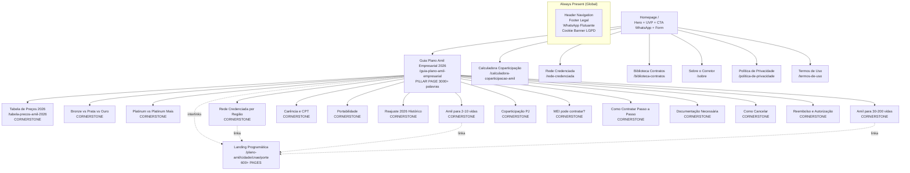
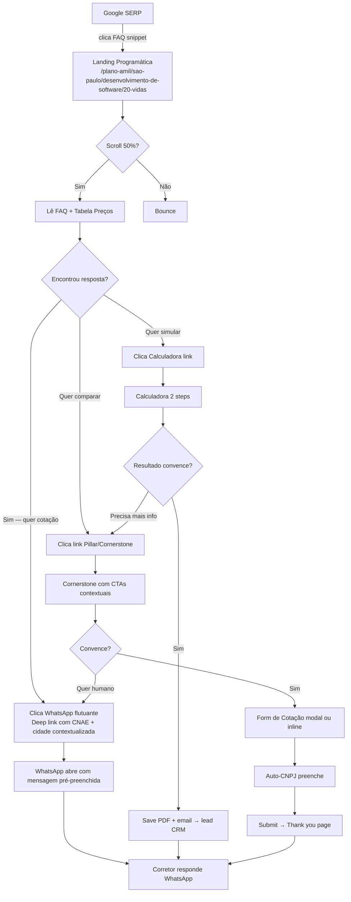
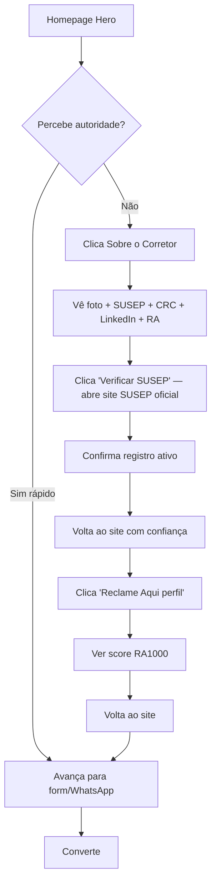
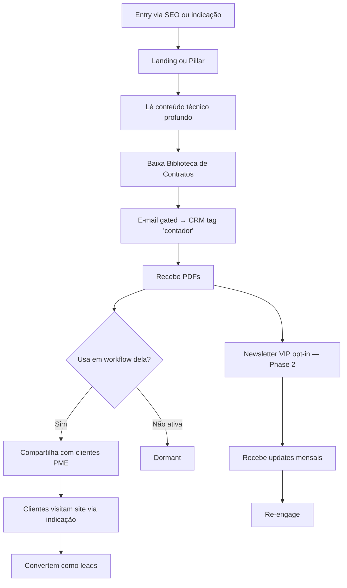
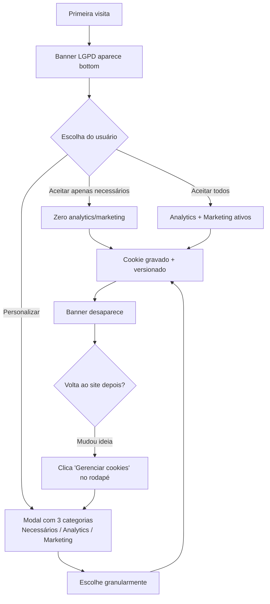

# planoamilempresas.com.br — UI/UX Specification

**Documento:** Front-End Specification v1.0
**Projeto:** planoamilempresas.com.br
**Autor:** Uma (UX/UI Designer — Empathizer ♋) — Synkra AIOS
**Data:** 2026-04-16
**Baseline técnico:** Next.js 14 App Router + Radix UI + Tailwind CSS (herdado do clone, adaptado para Amil)
**Status:** Draft v1.0 — bloqueia Epic 3 Story 3.2 (Template de Cornerstone)

---

## Introduction

Este documento define as **metas de experiência do usuário, arquitetura de informação, fluxos de usuário e especificações de design visual** para o `planoamilempresas.com.br`. Serve como fundação única para o design visual e o desenvolvimento frontend, garantindo uma experiência coesa, acessível e centrada no decisor PJ — com a ambição de ser o site mais confiável e eficiente do nicho de planos Amil empresariais no Brasil.

A especificação honra o pivot arquitetural para **Next.js + Radix UI + Tailwind** (PRD v1.2 + `architecture.md`), aproveitando o design system herdado do codebase pré-existente do stakeholder e ajustando para a identidade visual Amil + posicionamento "consultor editor especialista".

### Overall UX Goals & Principles

#### Target User Personas

Consolidadas a partir do `market-research.md` e refinadas pelo `brainstorming-session-results.md`:

**1. Marcelo — Sócio-Fundador PME (persona primária, 2–30 vidas)**
- Idade 32–52 anos, sócio de empresa de tecnologia/serviços profissionais/consultoria
- Decisão centralizada (sozinho ou 1-2 sócios); faz tudo entre reuniões
- Tempo = recurso mais escasso; 3–10 dias de pesquisa antes de ceder contato
- Acessa majoritariamente no **mobile** (entre deslocamentos, almoço, à noite)
- **Key pain:** "Não tenho tempo para comparar 10 opções. Preciso de informação real, não papo de vendedor."
- **Emotional need:** confiança de que decidiu certo na 1ª vez (redução do custo de arrependimento)

**2. Camila — Gestora de RH PME (persona primária, 30–200 vidas)**
- Idade 28–45, formação em Administração/Psicologia/RH
- Comparará 3–5 cotações; fará planilha para diretoria
- Ciclo de decisão 30–90 dias; valoriza atendimento consultivo
- Acessa majoritariamente no **desktop** (horário comercial)
- **Key pain:** "Preciso apresentar comparativo técnico com rede, carência, reajuste histórico."
- **Emotional need:** ser percebida como RH estratégico, não burocrático

**3. Eduardo — Financeiro/Controladoria (persona secundária, veto player)**
- Idade 35–55, gestor financeiro em PME média-grande
- Não inicia busca; recebe inputs do sócio ou RH
- Foco em custo total 3 anos + dedutibilidade fiscal
- **Key pain:** "Quero previsibilidade de reajuste nos próximos 3 anos, não só preço do 1º mês."

**4. Renata — Contadora/Consultora (persona terciária, multiplicador)**
- Idade 30–50, contabilidade digital (Contabilizei-like) ou escritório boutique
- Multiplica indicações para 20–200 clientes PME
- Valoriza conteúdo técnico compartilhável
- **Key pain:** "Preciso de fontes confiáveis para orientar clientes sem virar especialista em saúde."

#### Usability Goals

- **Descoberta rápida de informação relevante:** decisor encontra tabela de preço + CNAE + região em **<30 segundos** a partir da homepage
- **Cotação sem fricção:** formulário completo em **<90 segundos** (6 campos + auto-CNPJ em <2s)
- **Transparência radical:** 80%+ das informações de decisão acessíveis sem exigir contato (tabela, rede, reajuste histórico, FAQs, calculadora)
- **Credibilidade imediata:** decisor identifica E-E-A-T (corretor + SUSEP + ANS + RA) em **<5 segundos** de landing
- **Velocidade perceptível:** LCP < 2,0s, INP < 200ms em 95% das páginas (field data)
- **Acessibilidade inclusiva:** WCAG 2.1 AA em 100% das páginas (NFR9)
- **Baixo anti-job:** zero pop-ups invasivos, zero 0800, zero pressão

#### Design Principles

1. **Transparência Radical** — Tabelas, preços, rede e dados visíveis **antes** de qualquer CTA de contato. O site entrega valor, depois pede engajamento.
2. **Autoridade Sem Intimidação** — E-E-A-T (corretor nomeado, SUSEP, ANS, RA1000) exibido com confiança mas sem jargão. Tom: especialista acolhedor, não palestrante corporativo.
3. **Velocidade Perceptível** — Micro-interações suaves (não ausentes) reforçam a sensação de fluidez. Transições <200ms, skeletons em lugar de spinners onde possível.
4. **Mobile-First com Respeito ao Desktop** — Layout base otimizado para 360–768px; desktop ganha enriquecimentos (TOC lateral, comparações lado a lado) sem perder hierarquia.
5. **Progressive Disclosure** — Informação em camadas: overview → detalhe → expert. FAQs colapsados, tabelas filtradas, calculadora em 2 steps.
6. **Accessible by Default** — Contraste ≥4,5:1, focus visible, navegação por teclado, aria-labels, skip-links, semântica HTML correta. Não é verniz — é fundação.
7. **Inversão do Ônus** — "Simule você mesmo e, se quiser, fale com o corretor" em vez de "Solicite cotação". Controle com o usuário.

### Change Log

| Date | Version | Description | Author |
|------|---------|-------------|--------|
| 2026-04-16 | 1.0 | Draft inicial — design system, IA, wireframes, atomic component library, WCAG AA | Uma (UX Design) |
| 2026-04-26 | 1.1 | Patch pós Pax re-validação: nomenclatura produtos atualizada (Bronze→Platinum Mais), unDraw permitido (era proibido), Open Questions 1-3 resolvidas com decisões Story 1.0, status atualizado | Uma (UX) |

---

## Information Architecture (IA)

### Site Map / Screen Inventory



**Route Inventory:**

| Route | Type | Purpose | Priority |
|-------|------|---------|----------|
| `/` | Homepage | Hero + UVP + form + destaques | P0 |
| `/guia-plano-amil-empresarial` | Pillar | Guia mestre 3000+ palavras | P0 |
| `/[slug]` (15 páginas) | Cornerstone | Artigos editoriais 2000+ palavras | P0 |
| `/plano-amil/[cidade]/[cnae]/[porte]` (600+) | Programmatic | Landing long-tail | P1 |
| `/tabela-precos-amil-2026` | Tool | Tabela interativa + changelog | P0 |
| `/calculadora-coparticipacao-amil` | Tool | Simulador custo 3 anos | P0 |
| `/rede-credenciada` | Tool | Busca por CEP/cidade | P1 |
| `/biblioteca-contratos` | Lead Magnet | Download gated docs | P1 |
| `/sobre` | Authority | Corretor + credenciais | P0 |
| `/politica-de-privacidade` | Legal | LGPD | P0 |
| `/termos-de-uso` | Legal | Termos | P0 |
| `/404` | Error | Busca + links top | P0 |

### Navigation Structure

**Primary Navigation (Desktop Header):**
- Logo (→ `/`)
- "Guia Completo" (→ pillar) — dropdown revela 15 cornerstones agrupados por tema
- "Tabela de Preços" (→ tool)
- "Calculadora" (→ tool)
- "Rede Credenciada" (→ tool)
- "Sobre o Corretor" (→ authority)
- **CTA primário:** "Cotar no WhatsApp" (botão verde `#00C389`)

**Primary Navigation (Mobile — Bottom Tab Bar Sticky):**
- [🏠 Início] [📊 Preços] [🧮 Simular] [💬 WhatsApp] [☰ Menu]

Decisão mobile-first: **bottom tab bar** em vez de hamburger, porque os 4 CTAs principais são frequência alta e o polegar acessa mais facilmente a borda inferior.

**Secondary Navigation (contextual):**
- Dentro de cornerstones: TOC lateral sticky (desktop) / TOC colapsável topo (mobile)
- Breadcrumbs em todas páginas internas: `Início > Guia > [Artigo]`
- "Related articles" no final de cada cornerstone (máx 4)
- Dentro de landings programáticas: links "Páginas irmãs" (mesma cidade OU mesmo CNAE)

**Footer Navigation:**
- 4 colunas (desktop) / stack (mobile):
  1. **Institucional:** Sobre, Política de Privacidade, Termos, Gerenciar Cookies, Solicitar/Excluir Dados (LGPD)
  2. **Recursos:** Pillar, Tabela, Calculadora, Rede, Biblioteca
  3. **Contato:** WhatsApp direto, e-mail, LinkedIn do corretor
  4. **Compliance:** Logos ANS + SUSEP + LGPD + Reclame Aqui (todos clicáveis para fontes oficiais)
- Disclaimer ANS RN 195/2009 em texto menor abaixo das colunas
- Copyright + data da última build

**Breadcrumbs:**
- Sempre visíveis em páginas internas (home não tem)
- Schema BreadcrumbList JSON-LD
- Formato: `Início > Guia > Cornerstone` com separadores `›` (aria-label="Navegação estrutural")

---

## User Flows

### Flow 1: Decisor descobre via SERP → Converte em Lead (golden path)

**Persona:** Marcelo (sócio-fundador, mobile)
**Entry:** Google search "plano amil empresa 20 vidas SP" → clica em snippet do nosso programmatic landing



**Critical moments:**
- **Landing → scroll 50%:** depende de hero com H1 claro + primeiras 200 palavras respondendo intent específico ("plano amil para empresa de software em SP com 20 vidas" → explicação direta + tabela de preço)
- **Scroll → conversão:** CTAs contextuais a cada seção, não agressivos
- **WhatsApp primeiro, form segundo:** mobile users preferem WhatsApp (stats do clone + research); form é fallback

### Flow 2: RH pesquisa profundamente → Cotação Formal

**Persona:** Camila (RH, desktop)
**Entry:** SERP "comparativo amil bronze prata ouro empresa" → cornerstone de comparativo

```mermaid
graph TD
    A[Google SERP] -->|cornerstone comparativo| B[/amil-bronze-vs-prata-vs-ouro]
    B --> C[Lê TOC lateral + escaneia comparativo]
    C --> D[Scroll até Tabela Side-by-Side]
    D --> E{Tem rede regional dela?}
    E -->|Precisa validar| F[Clica Rede Credenciada]
    E -->|Sim| G[Clica Tabela Preços atualizada]
    F --> H[Busca CEP + especialidades necessárias]
    H --> I[Filtra resultados]
    I --> J{Rede OK?}
    J -->|Sim| G
    J -->|Não| X1[Abandona]
    G --> K[Vê tabela + filtra por porte 50 vidas]
    K --> L[Export PDF da tabela]
    L --> M[Clica 'Solicitar cotação formal']
    M --> N[Form de Cotação completo 6 campos]
    N --> O[Auto-CNPJ]
    O --> P[Submit + escolhe canal preferido: email/WhatsApp]
    P --> Q[Thank you + próximos passos]
    Q --> R[Corretor envia proposta em 2h úteis]
```

**Critical moments:**
- **TOC lateral desktop:** Camila scanneia; TOC sticky facilita jump to section
- **Export PDF tabela:** Crítico para ela levar para diretoria (social job)
- **Canal preferido no form:** opção de escolher email formal (ela) vs WhatsApp (Marcelo)

### Flow 3: Visitante Cético → Valida Autoridade → Converte

**Persona:** Qualquer decisor + cético / veto player (Eduardo)
**Entry:** Clica homepage → desconfia → investiga



**Critical moments:**
- **Página Sobre é conversion asset, não institucional:** foto, bio profissional, credenciais verificáveis externamente, CTAs "Falar no WhatsApp" + "Ver no LinkedIn"
- **Selos clicáveis para fontes oficiais:** se o decisor verifica SUSEP e Reclame Aqui e confirma, a confiança é 10x maior que qualquer copy

### Flow 4: Contador Descobre → Indica para Clientes

**Persona:** Renata (contadora, multiplicadora)
**Entry:** SERP "guia beneficios empresa" OR indicação de colega



**Critical moment:**
- **Biblioteca Contratos é loop viral:** conteúdo técnico gratuito compartilhável transforma contadora em embaixadora

### Flow 5: Cookie Consent LGPD (primeira visita)



**Critical:** banner é NÃO-bloqueante (usuário pode navegar enquanto decide), mas scripts analytics/marketing não disparam até consent.

---

## Wireframes & Screen Specifications

Wireframes abaixo são **descrições estruturais de alta fidelidade** (não mockups pixel-perfect). Implementação visual final será feita em `*build` via Tailwind + componentes Radix, guiada por estes specs + tokens (seção abaixo).

### Screen 1: Homepage (`/`)

**Objetivo:** Primeira impressão de autoridade + conversão rápida para decisores de alta intenção

**Layout Mobile (360–768px):**

```
┌─────────────────────────────┐
│ HEADER (sticky)             │
│ [Logo]          [Menu ☰]    │
├─────────────────────────────┤
│                             │
│  HERO                       │
│  H1: O corretor Amil        │
│  especialista em empresas   │
│                             │
│  Subtitle: Tabelas reais,   │
│  cotação em WhatsApp,       │
│  decisão sem arrependimento │
│                             │
│  [Cotar no WhatsApp 💬]    │  ← botão verde #00C389 principal
│  [Ver tabela 2026 →]       │  ← secundário
│                             │
│  📊 Compliance badges       │
│  ANS · SUSEP · LGPD · RA    │
├─────────────────────────────┤
│                             │
│  SEÇÃO 2: Proposta          │
│  "Você toma a decisão mais  │
│  importante de 3 anos..."   │
│                             │
│  3 pilares:                 │
│  [Tabela real mensal]       │
│  [Corretor autorizado]      │
│  [Cotação em 30s]           │
├─────────────────────────────┤
│                             │
│  SEÇÃO 3: Guia em destaque  │
│  "Comece aqui:              │
│   Guia Completo 2026"       │
│                             │
│  [CTA → pillar]             │
├─────────────────────────────┤
│                             │
│  SEÇÃO 4: Cornerstones      │
│  (horizontal scroll cards)  │
│  ← → tabela / Bronze vs Prata│
│  rede / calculadora / ...   │
├─────────────────────────────┤
│                             │
│  SEÇÃO 5: FAQs top 5        │
│  (accordion colapsado)      │
│  ▽ Quem pode contratar?     │
│  ▽ Qual o preço médio?      │
│  ▽ Tem carência?            │
│  ▽ Qual a rede?             │
│  ▽ Como cancelar?           │
├─────────────────────────────┤
│                             │
│  SEÇÃO 6: Formulário        │
│  "Receba sua cotação"       │
│  [Nome] [Email]             │
│  [WhatsApp] [CNPJ]          │
│  [Vidas ▽]                  │
│  [Mensagem opcional]        │
│  ☐ Aceito LGPD              │
│  [Turnstile widget]         │
│  [Enviar →]                 │
├─────────────────────────────┤
│                             │
│  SEÇÃO 7: Autor             │
│  [foto corretor] Nome       │
│  SUSEP #XXX · LinkedIn      │
│  [Conhecer corretor →]      │
├─────────────────────────────┤
│ FOOTER                      │
│ Links · Selos · Disclaimers │
│ © 2026 — atualizado abr/26  │
└─────────────────────────────┘

STICKY: [💬 WhatsApp button bottom-right]
TAB BAR BOTTOM (mobile):
[🏠] [📊] [🧮] [💬] [☰]
```

**Layout Desktop (≥1024px):**

```
┌───────────────────────────────────────────────────────────────┐
│ HEADER Navigation (sticky)                                    │
│ [Logo] Guia▽ Preços Calculadora Rede Sobre    [Cotar WA 💬] │
├───────────────────────────────────────────────────────────────┤
│                                                               │
│  HERO (2 columns)                                             │
│  ┌─────────────────────┬───────────────────────────────┐     │
│  │ H1 grande           │                               │     │
│  │ Subtitle            │    [Imagem corretor           │     │
│  │ [CTA WA]            │     ou infográfico]           │     │
│  │ [CTA Tabela]        │                               │     │
│  │ Selos compliance    │                               │     │
│  └─────────────────────┴───────────────────────────────┘     │
├───────────────────────────────────────────────────────────────┤
│ ...seções 2-6 em layout wide com 2-3 colunas where fits      │
│ Sidebar opcional com CTA sticky em seções 3-5                │
└───────────────────────────────────────────────────────────────┘
```

**Componentes usados:**
- `<Hero />` (organism)
- `<ComplianceBadges layout="horizontal" />` (molecule)
- `<CornerstoneCard />` (molecule) x N
- `<FAQ />` (organism with Radix Accordion)
- `<QuoteForm />` (organism)
- `<AuthorBio compact />` (molecule)
- `<WhatsAppButton variant="floating" />` (atom)
- `<MobileTabBar />` (organism)

---

### Screen 2: Pillar Page (`/guia-plano-amil-empresarial`)

**Objetivo:** Guia mestre que captura tráfego de head term + distribui autoridade para cornerstones

**Layout Desktop:**

```
┌───────────────────────────────────────────────────────────────┐
│ HEADER                                                        │
├───────────────────────────────────────────────────────────────┤
│ Breadcrumbs: Início › Guia                                    │
├───────────────────────────────────────────────────────────────┤
│                                                               │
│  HERO (3000+ palavras, 18-22 min leitura)                     │
│  H1: Plano de Saúde Amil Empresarial 2026 — Guia Completo    │
│                                                               │
│  Meta: [Autor corretor] [Atualizado abr/26] [22 min]         │
│                                                               │
│  Sub: Tudo que você precisa saber antes de contratar.        │
│                                                               │
│  CTAs: [Cotar WhatsApp] [Ver tabela]                          │
├───────────────────────────────────────────────────────────────┤
│ ┌──────┐ ┌────────────────────────────────┐ ┌──────────────┐ │
│ │ TOC  │ │                                │ │ Sidebar CTA  │ │
│ │      │ │  H2 O que é plano Amil...      │ │ sticky       │ │
│ │ ▪ 1  │ │                                │ │              │ │
│ │ ▪ 2  │ │  [Conteúdo + images +          │ │ [Cotar WA]   │ │
│ │ ▪ 3  │ │   tabelas +  FAQs              │ │ [Calc]       │ │
│ │ ...  │ │   + interlinks]                │ │              │ │
│ │ ▪ 12 │ │                                │ │ Related:     │ │
│ │ ▪ FAQ│ │  H2 Produtos Amil (Bronze→PM)  │ │ - art 1      │ │
│ │      │ │                                │ │ - art 2      │ │
│ │(sticky)                                  │ │              │ │
│ └──────┘ └────────────────────────────────┘ └──────────────┘ │
├───────────────────────────────────────────────────────────────┤
│                                                               │
│  FAQ Section (FAQPage schema)                                 │
│  10+ Q&A em accordion                                         │
├───────────────────────────────────────────────────────────────┤
│                                                               │
│  CTA Final                                                    │
│  "Pronto para sua cotação?"                                   │
│  [Cotar WhatsApp] [Solicitar orçamento por email]             │
├───────────────────────────────────────────────────────────────┤
│  Related articles (4 cards)                                   │
├───────────────────────────────────────────────────────────────┤
│ FOOTER                                                        │
└───────────────────────────────────────────────────────────────┘
```

**Layout Mobile:**
- TOC colapsável no topo (Radix Accordion)
- Sidebar removida; CTAs contextuais inline a cada 3-4 seções
- Bottom tab bar + WhatsApp flutuante

**Componentes específicos:**
- `<ArticleToc sections={...} sticky />`
- `<CtaSidebar sticky />`
- `<FaqPage items={...} schemaEnabled />`
- `<InternalLink to={cornerstone} contextual />` (embed inline no body)

---

### Screen 3: Cornerstone Template

**Objetivo:** Artigo editorial 2000+ palavras com schema rich + interlinking

**Estrutura (herdada/adaptada do clone):**

```
┌─────────────────────────────────────┐
│ HEADER + Breadcrumbs                │
├─────────────────────────────────────┤
│ HERO Artigo                         │
│ [Badge: Categoria — ex "Preços"]    │
│ H1 (único, SEO-optimized)           │
│ Subtitle (contexto)                 │
│ Meta: [Corretor] [Abr/26] [12 min]  │
├─────────────────────────────────────┤
│ [TOC] [Body with sections, tables,  │
│       callouts, FAQs, disclaimers]  │
├─────────────────────────────────────┤
│ Contextual CTAs inline              │
│ (a cada 2-3 seções)                 │
├─────────────────────────────────────┤
│ FAQ Section (5+ Q&A)                │
├─────────────────────────────────────┤
│ Final CTA Box                       │
│ "Quer falar com o corretor?"        │
├─────────────────────────────────────┤
│ Related Articles (3-4 cards)        │
├─────────────────────────────────────┤
│ FOOTER                              │
└─────────────────────────────────────┘
```

---

### Screen 4: Programmatic Landing Template (`/plano-amil/[cidade]/[cnae]/[porte]`)

**Objetivo:** Long-tail SEO com 800-1200 palavras únicas por combinação, focado em conversão rápida

```
┌─────────────────────────────────────┐
│ HEADER + Breadcrumbs (hierarchy:    │
│ Início > Cidade > CNAE > Porte)     │
├─────────────────────────────────────┤
│ HERO contextualizado                │
│ H1: Plano Amil Empresarial para     │
│ [CNAE] em [Cidade] — [Porte vidas]  │
│                                     │
│ Sub: Contextualizado por combinação │
│                                     │
│ Meta: [Corretor] [Atualizado]       │
│                                     │
│ [CTA Cotar WA] [Ver tabela]         │
├─────────────────────────────────────┤
│ SEÇÃO 1: Sobre Amil para [CNAE]     │
│ 400 palavras específicas do setor   │
├─────────────────────────────────────┤
│ SEÇÃO 2: Rede em [Cidade]           │
│ 300 palavras + lista destaque       │
│ [Ver rede completa →]               │
├─────────────────────────────────────┤
│ SEÇÃO 3: Preços para [Porte]        │
│ 200 palavras + PriceTable filtrada  │
│ [Ver tabela completa →]             │
├─────────────────────────────────────┤
│ SEÇÃO 4: FAQs específicas (5)       │
├─────────────────────────────────────┤
│ Form de cotação inline              │
├─────────────────────────────────────┤
│ Links "Páginas irmãs"               │
│ - Outros CNAEs na mesma cidade      │
│ - Mesma CNAE em outras cidades      │
├─────────────────────────────────────┤
│ FOOTER                              │
└─────────────────────────────────────┘
```

---

### Screen 5: Tabela de Preços (`/tabela-precos-amil-2026`)

**Objetivo:** Ferramenta única no mercado (atualização mensal) + SEO para "tabela amil 2026"

```
┌─────────────────────────────────────┐
│ HEADER + Breadcrumbs                │
├─────────────────────────────────────┤
│ HERO                                │
│ H1: Tabela de Preços Amil           │
│ Empresarial 2026                    │
│                                     │
│ Badge: "Atualizada em abril/2026"   │
│ [Ver changelog ↓]                   │
├─────────────────────────────────────┤
│ FILTROS (sticky em desktop)         │
│ Produto: [Bronze|Bronze Mais|Prata| │
│           Ouro|Platinum|Plat. Mais] │
│ Acomodação: [QC|QP]                 │
│ Região: [SP|RJ|MG|...|Nacional]     │
│ Coparticipação: [30%|40%|sem]       │
│ Porte: [2-10|11-30|31-100|101-200]  │
├─────────────────────────────────────┤
│ TABELA (responsive: grid → cards)   │
│ ┌──────────────────────────────┐    │
│ │ Faixa etária │ Valor/vida/mês│    │
│ │ 0–18 anos    │ R$ 310,00     │    │
│ │ 19–23        │ R$ 345,00     │    │
│ │ ...          │ ...           │    │
│ └──────────────────────────────┘    │
│                                     │
│ [Baixar tabela PDF]                 │
│ [Simular na calculadora →]          │
├─────────────────────────────────────┤
│ Conteúdo editorial 800+ palavras    │
│ "Como ler esta tabela"              │
│ "Fatores que afetam preço"          │
│ "Exemplos práticos"                 │
├─────────────────────────────────────┤
│ CHANGELOG (últimos 12 meses)        │
│ - abr/2026: reajuste X%             │
│ - mar/2026: nenhuma alteração       │
│ - ...                               │
├─────────────────────────────────────┤
│ FAQs + CTA                          │
├─────────────────────────────────────┤
│ Disclaimer ANS RN 195/2009          │
└─────────────────────────────────────┘
```

**Mobile:** tabela vira cards empilhados por faixa etária, filtros em modal ou accordion.

---

### Screen 6: Calculadora (`/calculadora-coparticipacao-amil`)

**Objetivo:** Feature inédita no mercado + captura de lead qualificado

**Step 1 — Inputs:**

```
┌─────────────────────────────────────┐
│ HEADER + Breadcrumbs                │
├─────────────────────────────────────┤
│ H1: Calculadora de Custo Total      │
│ "Simule 36 meses em 30 segundos"    │
├─────────────────────────────────────┤
│ STEP 1 DE 2                         │
│ ┌─────────────────────────────────┐ │
│ │                                 │ │
│ │  Número de vidas                │ │
│ │  [slider ou input]              │ │
│ │                                 │ │
│ │  Faixa etária média             │ │
│ │  [distribuição visual]          │ │
│ │                                 │ │
│ │  Produto                        │ │
│ │  [cards selecionáveis]          │ │
│ │  ◉ Bronze  ○ Bronze Mais        │ │
│ │  ○ Prata  ○ Ouro                │ │
│ │  ○ Platinum  ○ Platinum Mais    │ │
│ │                                 │ │
│ │  Acomodação                     │ │
│ │  [toggle QC / QP]               │ │
│ │                                 │ │
│ │  Coparticipação                 │ │
│ │  [toggle Sim / Não]             │ │
│ │                                 │ │
│ │  Sinistralidade estimada        │ │
│ │  [slider: Baixa — Média — Alta] │ │
│ │                                 │ │
│ │  [Calcular →]                   │ │
│ │                                 │ │
│ └─────────────────────────────────┘ │
│                                     │
│ Disclaimer: "Estimativa..."         │
└─────────────────────────────────────┘
```

**Step 2 — Result:**

```
┌─────────────────────────────────────┐
│ STEP 2 DE 2 — Resultado             │
│                                     │
│ [Resumo: 30 vidas, Prata QC, com    │
│ coparticipação, sinistralidade      │
│ média]                              │
│ [← Editar inputs]                   │
├─────────────────────────────────────┤
│ GRÁFICO DE BARRAS                   │
│ Custo mensal empresa (azul)         │
│ Custo mensal colaborador (verde)    │
│ Ao longo de 36 meses                │
│                                     │
│ [Visual: bar chart month 1-36]      │
├─────────────────────────────────────┤
│ TOTALS                              │
│ Ano 1: R$ 225.000 (empresa)         │
│        R$  28.800 (colaboradores)   │
│ Ano 2: R$ 245.250                   │
│ Ano 3: R$ 267.000                   │
│ ─────────────────────────────       │
│ TOTAL 3 anos: R$ 737.250            │
├─────────────────────────────────────┤
│ Comparação: com vs. sem copart      │
│ [Chart side-by-side]                │
├─────────────────────────────────────┤
│ [Exportar PDF] [Receber por email]  │
│ [Falar com corretor no WhatsApp]    │
├─────────────────────────────────────┤
│ Disclaimer expandido                │
└─────────────────────────────────────┘
```

**Estados especiais:**
- Loading durante cálculo (skeleton)
- Erro com retry + fallback WhatsApp
- "Receber por email": inline modal com email + consent LGPD

---

### Screen 7: Rede Credenciada (`/rede-credenciada`)

> **Patch v1.1 (2026-04-26 SCP v1.2.3):** Layout atualizado para refletir dataset real (9.325 prestadores · 26 UFs · 11 redes ativas). Removido campo "Especialidade" (gap conhecido — não está no Power BI fonte). Removido "endereço completo" (só temos bairro + município + UF). Busca livre primária com Radix `Command` + atalhos por estado + filtros avançados em accordion. Cobertura completa em `docs/sprint-change-proposal-v1.2.3.md` §7.1.

**Layout v1.1:**

```
┌──────────────────────────────────────────────────┐
│ HEADER (fixo)                                    │
├──────────────────────────────────────────────────┤
│ HERO                                             │
│ H1: Rede Credenciada Amil — 9.325 prestadores   │
│ Subtítulo: "Encontre hospitais, laboratórios     │
│ e clínicas Amil em sua cidade"                   │
│ Atualizado em: 26 abr 2026 ✓                     │
├──────────────────────────────────────────────────┤
│ BUSCA PRINCIPAL (Radix Command/Combobox)         │
│ ┌────────────────────────────────────────────┐ │
│ │ 🔍 Buscar cidade, bairro ou prestador…    │ │
│ └────────────────────────────────────────────┘ │
│ ▸ Sugestões: Rio de Janeiro, São Paulo, Brasília│
├──────────────────────────────────────────────────┤
│ ATALHOS POR ESTADO (chips horizontais top-5)     │
│ [RJ 3.696] [SP 2.996] [DF 447] [PR 394] [+22]   │
├──────────────────────────────────────────────────┤
│ FILTROS AVANÇADOS (Radix Accordion colapsável)   │
│ ▸ Tipo de prestador: [Hospital] [Lab] [Clínica] │
│   [Diagn. Imagem] [Maternidade] [Outro]          │
│ ▸ Rede/Produto Amil: [combobox 11 redes]        │
│   (sem Especialidade — gap dataset Power BI)     │
├──────────────────────────────────────────────────┤
│ RESULTADOS (lazy-load por scroll, 25 por vez)    │
│ ┌──────────────────────────────────────────┐ │
│ │ 🏥 Hospital São Lucas                     │ │
│ │ Copacabana · Rio de Janeiro · RJ          │ │
│ │ Aceita: Black, S750, Platinum +5         │ │
│ │ [Ver detalhes →]                          │ │
│ └──────────────────────────────────────────┘ │
│ [continua…]                                      │
├──────────────────────────────────────────────────┤
│ FAQ (8 perguntas, FAQPage schema JSON-LD)        │
├──────────────────────────────────────────────────┤
│ CTA: Quer cotação para sua empresa?             │
│ [WhatsApp]  [Formulário]                        │
├──────────────────────────────────────────────────┤
│ DISCLAIMER: "Rede sujeita a alterações pela     │
│ operadora. Confirmar via app oficial Amil       │
│ antes de uso. Última atualização: 26 abr 2026." │
│ + corretor SUSEP                                 │
└──────────────────────────────────────────────────┘
```

**Componentes envolvidos:**
- `<NetworkSearch />` Client Component com index pré-built MiniSearch (≤30KB)
- `<NetworkResultCard />` (sem campo "especialidade" — apenas nome + bairro + município + UF + chip de redes)
- `<UfShortcutChips />` (5 estados densos + "+N" link)
- `<NetworkAdvancedFilters />` (Accordion com tipo + rede)
- `<RedeCredenciadaFAQ />` (8 perguntas com FAQPage schema)

---

### Screen 7b: Página-Prestador (`/rede/[uf]/[municipio]/[prestador-slug]`) — NOVO v1.1

> **Adicionado v1.1 (SCP v1.2.3):** padrão de página-prestador para os ~7.500 URLs SSG indexáveis. Realista dado gaps do dataset (sem endereço completo / telefone / coordenadas). Detalhes em `sprint-change-proposal-v1.2.3.md` §7.

**Layout:**

```
┌─────────────────────────────────────────────────┐
│ Breadcrumb: Início › Rede › RJ › Rio › [Nome] │
├─────────────────────────────────────────────────┤
│ H1: [NOME DO PRESTADOR]                         │
│ Subtítulo: Bairro · Município · UF              │
│ Tipo inferido (badge): 🏥 Hospital              │
├─────────────────────────────────────────────────┤
│ COBERTURA AMIL (lista visual de 11 redes)       │
│ ✓ AMIL ONE S6500 BLACK QP                       │
│ ✓ BLACK                                         │
│ ✓ AMIL S750 QP                                  │
│ ✗ ADESÃO BRONZE RJ (não credenciado)            │
│ … (todas as 11 redes listadas)                  │
├─────────────────────────────────────────────────┤
│ MAPA APROXIMADO (Leaflet/OSM, centroide bairro) │
│ ⚠️ Aviso: localização aproximada (ver app oficial│
│   Amil para endereço exato)                     │
├─────────────────────────────────────────────────┤
│ COMO USAR ESTE PRESTADOR                        │
│ 1. Confirme cobertura no app oficial Amil      │
│ 2. Agende com seu plano em mãos                │
│ 3. [Botão WhatsApp para corretor]              │
├─────────────────────────────────────────────────┤
│ PRESTADORES PRÓXIMOS (mesmo bairro)             │
│ [Card] [Card] [Card]                            │
├─────────────────────────────────────────────────┤
│ PERGUNTAS FREQUENTES (FAQPage schema)           │
├─────────────────────────────────────────────────┤
│ DISCLAIMER + última atualização visível         │
└─────────────────────────────────────────────────┘
```

**Schema markup:** `MedicalOrganization` ou subtipo (`Hospital` / `MedicalClinic` / `MedicalLaboratory` / `EmergencyService`) baseado no tipo inferido. Fallback `LocalBusiness` para tipo "Outro".

**Sem inventar conteúdo:** o que o dataset não tem (telefone, endereço completo, especialidades) **não é exibido**. CTA "Confirmar no app oficial Amil" + WhatsApp ao corretor preserva confiança.

---

### Screen 7c: Página-Rede × UF (`/rede/[rede-slug]/[uf]`) — NOVO v1.1 [Cluster E]

> **Adicionado v1.1 (SCP v1.2.3):** Cluster E é o de maior conversão estimada (pre-purchase qualificado). Bloqueado até ADR-006 Accepted (advogado revisor co-sign). Detalhes em `sprint-change-proposal-v1.2.3.md` §3.2 + §7.

**Layout:**

```
┌─────────────────────────────────────────────────┐
│ Breadcrumb: Início › Rede › Amil S750 › SP     │
├─────────────────────────────────────────────────┤
│ H1: Onde o plano Amil S750 é aceito em São Paulo│
│ Subtítulo: 187 prestadores credenciados em SP   │
│ Atualizado: 26 abr 2026                         │
├─────────────────────────────────────────────────┤
│ STATS RÁPIDOS                                   │
│ 🏥 12 Hospitais · 🧪 24 Labs · 🏛 89 Clínicas │
│ Top cidades: SP capital (78), Campinas (12)…   │
├─────────────────────────────────────────────────┤
│ MAPA (Leaflet com pins por cidade)              │
├─────────────────────────────────────────────────┤
│ PARA EMPRESAS QUE QUEREM AMIL S750 EM SP       │
│ [3 parágrafos editoriais 400 palavras]          │
│ + tabela mensalidade base (link → /tabela…)     │
├─────────────────────────────────────────────────┤
│ LISTA DE PRESTADORES (agrupada por município)   │
│ ▾ São Paulo (78)                                │
│   - Hospital X · Vila Mariana                   │
│   - Hospital Y · Itaim Bibi                     │
│   …                                             │
│ ▾ Campinas (12)                                 │
│   …                                             │
├─────────────────────────────────────────────────┤
│ CTA: Cotação para esta rede                    │
│ [Formulário pre-preenchido com produto S750]   │
├─────────────────────────────────────────────────┤
│ DISCLAIMER + corretor SUSEP                     │
└─────────────────────────────────────────────────┘
```

**Schema markup:** `HealthInsurancePlan` + `ItemList` (de prestadores) + `FAQPage` + `BreadcrumbList`. Concorrentes mapeados em `competitor-analysis.md` não usam HealthInsurancePlan — gap competitivo total.

**SEO copy rule (regulatory copy):** Nenhuma promessa absoluta de cobertura ("aceita") sem o disclaimer "rede sujeita a alterações" no mesmo viewport.


---

### Screen 8: Formulário de Cotação (modal + page)

**Versão modal (aparece de qualquer página):**

```
┌─────────────────────────────────┐
│ [X] Solicite sua cotação        │
│                                 │
│ 6 campos apenas — 90s           │
│ ─────────────────────────────── │
│                                 │
│ Nome completo*                  │
│ [___________________________]   │
│                                 │
│ Email corporativo*              │
│ [___________________________]   │
│                                 │
│ WhatsApp*                       │
│ [(__) _____-____] ✓            │
│                                 │
│ CNPJ*                           │
│ [__.___.___/____-__]            │
│ → Auto-preenchendo...           │
│ ✓ Razão Social: [Empresa X]    │
│ ✓ CNAE: Desenv de software      │
│                                 │
│ Número de vidas*                │
│ [Selecione    ▽]               │
│                                 │
│ Mensagem (opcional)             │
│ [___________________________]   │
│                                 │
│ ☐ Aceito a política de          │
│   privacidade LGPD*             │
│                                 │
│ [Turnstile widget]              │
│                                 │
│ [Enviar cotação →]              │
│                                 │
│ 🔒 Seus dados estão protegidos. │
│ SUSEP #XXX · Corretor autorizado│
└─────────────────────────────────┘
```

**Estados:**
- Empty / Filling / Validating CNPJ / Submitting / Success / Error
- Mensagem success: "Recebido! Entraremos em contato em até 2h úteis via WhatsApp. Referência: LEAD-2026041612345"

---

### Screen 9: Sobre o Corretor (`/sobre`)

**Layout Desktop:**

```
┌───────────────────────────────────────────────────────────┐
│ HEADER + Breadcrumbs                                      │
├───────────────────────────────────────────────────────────┤
│                                                           │
│ ┌──────────────────┐ ┌──────────────────────────────┐    │
│ │                  │ │                              │    │
│ │  [Foto corretor  │ │  H1: [Nome Completo]         │    │
│ │   profissional,  │ │  Corretor Amil Autorizado    │    │
│ │   400x400px,     │ │                              │    │
│ │   alto contraste]│ │  SUSEP nº [XXXXXXXX]         │    │
│ │                  │ │  [Verificar no SUSEP →]      │    │
│ │                  │ │                              │    │
│ │                  │ │  Bio: 5-10 linhas sobre      │    │
│ │                  │ │  experiência com planos      │    │
│ │                  │ │  empresariais.               │    │
│ │                  │ │                              │    │
│ │                  │ │  [LinkedIn] [WhatsApp direto]│    │
│ └──────────────────┘ └──────────────────────────────┘    │
├───────────────────────────────────────────────────────────┤
│ CREDENCIAIS                                               │
│ ✓ Registro SUSEP nº XXX                                   │
│ ✓ CRC [se contador] ou CRA                                │
│ ✓ Certificação ANS [se aplicável]                         │
│ ✓ Filiação FENACOR                                        │
├───────────────────────────────────────────────────────────┤
│ A CORRETORA                                               │
│ Razão Social: [XXX Corretora de Seguros Ltda]            │
│ CNPJ: XX.XXX.XXX/XXXX-XX                                  │
│ Endereço: ...                                             │
│ Corretor autorizado a intermediar planos da Amil          │
│ Assistência Médica Internacional (registro ANS 326305)    │
├───────────────────────────────────────────────────────────┤
│ POR QUE AMIL PJ?                                          │
│ [2-3 parágrafos editoriais, NÃO comerciais]              │
├───────────────────────────────────────────────────────────┤
│ SELOS DE COMPLIANCE                                       │
│ [ANS] [SUSEP] [LGPD] [Reclame Aqui] [RA1000 quando ok]   │
│ (todos clicáveis para fontes oficiais)                    │
├───────────────────────────────────────────────────────────┤
│ CTAs                                                      │
│ [Falar no WhatsApp] [Solicitar cotação]                   │
├───────────────────────────────────────────────────────────┤
│ FOOTER                                                    │
└───────────────────────────────────────────────────────────┘
```

---

### Screen 10: 404 Page

```
┌─────────────────────────────────────┐
│ HEADER                              │
├─────────────────────────────────────┤
│                                     │
│  🔎  Página não encontrada          │
│                                     │
│  Mas podemos te ajudar:             │
│                                     │
│  Busca interna:                     │
│  [__________________] [🔍]          │
│                                     │
│  Ou visite:                         │
│  → Guia Completo                    │
│  → Tabela de Preços 2026            │
│  → Calculadora                      │
│  → Rede Credenciada                 │
│                                     │
│  Ou fale direto:                    │
│  [💬 WhatsApp]                      │
│                                     │
├─────────────────────────────────────┤
│ FOOTER                              │
└─────────────────────────────────────┘
```

---

## Component Library (Atomic Design)

Seguindo **Atomic Design methodology** (Brad Frost), organizamos em 5 níveis. Aproveitamos o **Radix UI + Tailwind baseline do clone** como fundação e customizamos para marca Amil.

### Atoms (átomos — building blocks irredutíveis)

Reaproveitados/customizados do clone:

| Atom | Source | Customização |
|------|--------|--------------|
| `<Button variant="primary|secondary|ghost|destructive" />` | Radix Slot + CVA | Cores Amil (primary=`#00C389`, secondary=`#0066B3`, ghost=neutro) |
| `<Input type="text|email|tel|cnpj" />` | HTML + Radix | Validação visual aria-invalid |
| `<Textarea />` | HTML | Autosize opcional |
| `<Label />` | Radix Label | Sempre associado via `htmlFor` |
| `<Badge variant="info|warning|success|compliance" />` | Tailwind only | Badges de compliance com ícones SVG |
| `<Icon name={...} />` | lucide-react | Set reduzido (20-30 ícones) |
| `<Link href variant="inline|button|nav" />` | Next.js Link | Underline on hover, focus visible |
| `<Spinner />` | SVG animado | Low-motion compatível (prefers-reduced-motion) |
| `<Avatar />` | Radix Avatar | Fallback initials |
| `<Checkbox />` | Radix Checkbox | LGPD-specific style |
| `<Toggle />` | Radix Switch | ON/OFF visual claro |
| `<Slider />` | Radix Slider | Calculadora: baixa/média/alta sinistralidade |

### Molecules (moléculas — combinações simples)

| Molecule | Composition |
|----------|-------------|
| `<FormField />` | Label + Input + ErrorMessage + HelperText |
| `<CNPJInput />` | Input + loading spinner + validation + auto-fill preview |
| `<ComplianceBadges layout="horizontal|grid|inline" />` | 4-5 Badge atoms com links externos |
| `<AuthorBio compact|full />` | Avatar + name + SUSEP + link LinkedIn |
| `<InfoCard variant />` | Icon + title + description (p/ proposta de valor) |
| `<CornerstoneCard />` | Image + category badge + title + excerpt + "read more" |
| `<BreadcrumbItem />` | Link + separator chevron |
| `<FaqItem />` | Accordion trigger + content com schema data |
| `<PriceRow />` | Faixa etária + valor + porte modifier |
| `<NetworkResultCard />` | Nome + tipo + endereço + especialidades + produtos |
| `<CtaBlock />` | Título + descrição + botão(ões) + disclaimer opcional |
| `<CookieBannerControls />` | 3 toggle switches + links política + 2 buttons (aceitar/personalizar) |

### Organisms (organismos — seções complexas)

| Organism | Composition |
|----------|-------------|
| `<Header />` | Logo + Navigation + CtaWhatsApp (desktop) / Menu (mobile) |
| `<MobileTabBar />` | 5 tabs sticky bottom (Início/Preços/Simular/WhatsApp/Menu) |
| `<Footer />` | 4 columns + ComplianceBadges + disclaimer + copyright |
| `<Hero variant />` | H1 + subtitle + CTAs + compliance + optional visual |
| `<CornerstoneList layout="grid|scroll" />` | Grid/scroll de CornerstoneCards |
| `<FAQPage items={...} schema />` | N FaqItems + FAQPage JSON-LD |
| `<PriceTable filters />` | Filtros + tabela + export PDF |
| `<Calculator />` | 2 steps + form + result visualization + CTAs |
| `<QuoteForm modal|inline />` | 6 FormFields + Turnstile + Submit + success state |
| `<NetworkSearch />` | Filters + results + map + pagination |
| `<WhatsAppButton variant="floating|inline|sticky-mobile" />` | Button + animation + aria |
| `<CookieConsent />` | Banner + modal granular + persistence |
| `<ArticleToc sections sticky />` | Nav list com highlights de section visível |
| `<Disclaimer type />` | Box com ícone + texto padronizado |
| `<RelatedArticles items={...} />` | 3-4 CornerstoneCards |
| `<BrokerCard />` | AuthorBio full + credenciais + CTAs |

### Templates (templates — layouts de página)

| Template | Usage |
|----------|-------|
| `RootLayout` | HTML shell + Header + Footer + MobileTabBar + CookieConsent + WhatsApp (app/layout.tsx) |
| `LandingLayout` | Layout para homepage + landings marketing (route group `(marketing)`) |
| `ContentLayout` | Layout editorial para pillar + cornerstones (sidebar TOC + CTA sticky) (route group `(content)`) |
| `ProgrammaticLayout` | Layout para `/plano-amil/[cidade]/[cnae]/[porte]` (breadcrumbs hierarchy + sections) |
| `ToolLayout` | Layout para tabela/calculadora/rede (wide content, no sidebar) |
| `AuthorityLayout` | Layout para página Sobre |
| `LegalLayout` | Layout simples para política de privacidade + termos |
| `ErrorLayout` | Layout para 404 + error boundary |

### Pages (instances concretas)

| Page | Template | Components uniquely used |
|------|----------|--------------------------|
| `/` (Home) | LandingLayout | Hero, InfoCards, CornerstoneList, FAQPage, QuoteForm, AuthorBio |
| `/guia-plano-amil-empresarial` | ContentLayout | ArticleToc, CtaBlock, internal interlinking components |
| `/[cornerstone-slug]` | ContentLayout | + RelatedArticles |
| `/plano-amil/[cidade]/[cnae]/[porte]` | ProgrammaticLayout | Segment-specific content blocks |
| `/tabela-precos-amil-2026` | ToolLayout | PriceTable + Changelog + FAQ |
| `/calculadora-coparticipacao-amil` | ToolLayout | Calculator |
| `/rede-credenciada` | ToolLayout | NetworkSearch |
| `/biblioteca-contratos` | ToolLayout | Download cards + gate modal |
| `/sobre` | AuthorityLayout | BrokerCard expanded |
| `/politica-de-privacidade` | LegalLayout | ProseBlock |
| `/termos-de-uso` | LegalLayout | ProseBlock |
| `/404` | ErrorLayout | Search + topLinks + WhatsApp CTA |

---

## Branding & Style Guide

### Design Tokens (`src/config/tokens.ts` — a ser exportado em DTCG formato W3C)

#### Colors

```typescript
const colors = {
  // Brand primary (Amil azul oficial)
  brand: {
    50: '#E6F0FA',
    100: '#CCE1F5',
    200: '#99C3EB',
    300: '#66A5E1',
    400: '#3387D7',
    500: '#0066B3',  // ← Amil primary
    600: '#005499',
    700: '#004280',
    800: '#003066',
    900: '#001F4D',
  },

  // Accent CTA (verde conversão)
  cta: {
    50: '#E6FAF2',
    100: '#CCF5E5',
    200: '#99EBCB',
    300: '#66E1B1',
    400: '#33D797',
    500: '#00C389',  // ← CTA primary
    600: '#00A371',
    700: '#008359',
    800: '#006342',
    900: '#00432B',
  },

  // Neutrals (gray scale)
  neutral: {
    50: '#FAFAFA',
    100: '#F5F5F5',
    200: '#EAEAEA',
    300: '#D4D4D4',
    400: '#A3A3A3',
    500: '#737373',
    600: '#525252',
    700: '#404040',
    800: '#262626',
    900: '#171717',
    950: '#0A0A0A',
  },

  // Semantic
  semantic: {
    success: '#059669',   // verde escuro confirmações
    warning: '#D97706',   // laranja escuro disclaimers
    error: '#DC2626',     // vermelho validação
    info: '#0EA5E9',      // azul info
  },

  // Backgrounds
  bg: {
    primary: '#FFFFFF',
    secondary: '#FAFAFA',
    tertiary: '#F5F5F5',
    inverse: '#171717',
  },

  // Text
  text: {
    primary: '#171717',      // near-black
    secondary: '#525252',
    tertiary: '#737373',
    inverse: '#FAFAFA',
    link: '#0066B3',
    linkHover: '#004280',
  },

  // Borders
  border: {
    light: '#EAEAEA',
    medium: '#D4D4D4',
    dark: '#A3A3A3',
    focus: '#00C389',  // outline focus = CTA green
  },
};
```

**Acessibilidade de contraste (WCAG AA):**
- Texto primary (`#171717`) sobre bg primary (`#FFFFFF`): **ratio 19.05:1** ✓ AAA
- Texto secondary (`#525252`) sobre bg primary: **ratio 7.74:1** ✓ AAA
- Brand 500 (`#0066B3`) sobre bg primary: **ratio 7.23:1** ✓ AAA
- CTA 500 (`#00C389`) sobre bg primary: **ratio 3.21:1** ✓ AA LARGE (≥18px bold ou ≥24px)
- CTA button text (`#FFFFFF`) sobre CTA 500 bg: **ratio 3.21:1** → **usar CTA 600** (`#00A371`) para text-on-bg = **ratio 4.89:1** ✓ AA
- Error (`#DC2626`) sobre bg primary: **ratio 5.09:1** ✓ AA

#### Typography

```typescript
const typography = {
  fonts: {
    sans: ['Inter', 'system-ui', '-apple-system', 'Segoe UI', 'Roboto', 'sans-serif'],
    display: ['Inter', 'system-ui', 'sans-serif'],  // mesmo family; weight 700 diferencia
    mono: ['JetBrains Mono', 'Menlo', 'Monaco', 'monospace'],
  },

  sizes: {
    xs: { fontSize: '12px', lineHeight: '18px' },
    sm: { fontSize: '14px', lineHeight: '22px' },
    base: { fontSize: '16px', lineHeight: '26px' },   // body default
    lg: { fontSize: '18px', lineHeight: '28px' },     // body large
    xl: { fontSize: '20px', lineHeight: '30px' },
    '2xl': { fontSize: '24px', lineHeight: '32px' },  // H3
    '3xl': { fontSize: '30px', lineHeight: '38px' },
    '4xl': { fontSize: '36px', lineHeight: '44px' },  // H2
    '5xl': { fontSize: '48px', lineHeight: '56px' },  // H1 desktop
    '6xl': { fontSize: '60px', lineHeight: '68px' },  // Hero desktop
  },

  weights: {
    regular: 400,
    medium: 500,
    semibold: 600,
    bold: 700,
  },

  letterSpacing: {
    tight: '-0.02em',    // H1/H2
    normal: '0',
    wide: '0.02em',      // uppercase badges, labels
  },
};
```

**Hierarquia tipográfica:**

| Element | Size mobile | Size desktop | Weight | LS |
|---------|-------------|--------------|--------|-----|
| H1 | 36px/44 | 48px/56 | 700 | tight |
| H2 | 28px/36 | 36px/44 | 700 | tight |
| H3 | 22px/30 | 24px/32 | 600 | normal |
| H4 | 18px/26 | 20px/30 | 600 | normal |
| Body | 16px/26 | 16px/26 | 400 | normal |
| Body large | 18px/28 | 18px/28 | 400 | normal |
| Small | 14px/22 | 14px/22 | 400 | normal |
| Label | 14px/22 | 14px/22 | 500 | wide |
| Button | 16px/22 | 16px/22 | 600 | normal |

**Font loading via `next/font`:**

```typescript
import { Inter } from 'next/font/google';
const inter = Inter({
  subsets: ['latin', 'latin-ext'],
  display: 'swap',
  variable: '--font-inter',
});
```

#### Spacing (8px grid)

```typescript
const spacing = {
  0: '0',
  0.5: '2px',
  1: '4px',
  2: '8px',     // base grid
  3: '12px',
  4: '16px',
  5: '20px',
  6: '24px',    // section padding mobile
  8: '32px',    // section padding desktop
  10: '40px',
  12: '48px',
  16: '64px',   // section break large
  20: '80px',
  24: '96px',
  32: '128px',  // hero break
};
```

#### Border Radius

```typescript
const radius = {
  none: '0',
  sm: '4px',     // small elements
  base: '8px',   // default cards, inputs
  md: '12px',    // buttons, larger cards
  lg: '16px',    // hero elements
  xl: '24px',    // featured cards
  full: '9999px', // pills, badges, avatars
};
```

#### Shadows

```typescript
const shadows = {
  none: 'none',
  sm: '0 1px 2px 0 rgb(0 0 0 / 0.05)',
  base: '0 1px 3px 0 rgb(0 0 0 / 0.1), 0 1px 2px -1px rgb(0 0 0 / 0.1)',
  md: '0 4px 6px -1px rgb(0 0 0 / 0.1), 0 2px 4px -2px rgb(0 0 0 / 0.1)',
  lg: '0 10px 15px -3px rgb(0 0 0 / 0.1), 0 4px 6px -4px rgb(0 0 0 / 0.1)',
  xl: '0 20px 25px -5px rgb(0 0 0 / 0.1), 0 8px 10px -6px rgb(0 0 0 / 0.1)',
  inner: 'inset 0 2px 4px 0 rgb(0 0 0 / 0.05)',
};
```

#### Motion / Transitions

```typescript
const motion = {
  duration: {
    fast: '100ms',
    base: '200ms',
    slow: '300ms',
    slower: '500ms',
  },
  easing: {
    linear: 'linear',
    default: 'cubic-bezier(0.4, 0, 0.2, 1)',
    in: 'cubic-bezier(0.4, 0, 1, 1)',
    out: 'cubic-bezier(0, 0, 0.2, 1)',
    inOut: 'cubic-bezier(0.4, 0, 0.2, 1)',
  },
};
```

**Respeitar `prefers-reduced-motion`:**

```css
@media (prefers-reduced-motion: reduce) {
  *, *::before, *::after {
    animation-duration: 0.01ms !important;
    animation-iteration-count: 1 !important;
    transition-duration: 0.01ms !important;
    scroll-behavior: auto !important;
  }
}
```

### Visual Style Direction

**Estética:** Minimalista-editorial, inspirada em `revista do Valor Econômico digital` (não site de banco). Muito whitespace, tabelas profissionais com zebra stripe sutil, gráficos minimalistas com paleta restrita.

**NÃO fazer:**
- ❌ Stock photos de "sorriso corporativo" genérico (banco genérico tipo Shutterstock sem curadoria)
- ❌ Gradientes modernos de startup (we are NOT a startup)
- ❌ Animações decorativas
- ❌ Cores neon/saturadas além da paleta
- ❌ Carousels automáticos (acessibilidade + conversão ruim)

**FAZER:**
- ✅ Fotografias reais (corretor real, equipe, possivelmente clientes com autorização)
- ✅ unDraw / Storyset (estratégia MVP — decisão Story 1.0 2026-04-24): banco gratuito de ilustrações SVG com paleta customizável (sincronizada com #0066B3). Em Phase 2 considerar upgrade para ilustrador próprio se quiser elevar visual.
- ✅ Infográficos originais (dados reais, fontes linkadas)
- ✅ Ícones lucide-react consistentes (stroke-width 1.5, size 20-24px)
- ✅ Tabelas bem diagramadas (zebra striping opacity 0.03)
- ✅ Gráficos minimalistas (recharts ou visx, paleta restrita)
- ✅ Data-visualization com fontes linkadas (ANS, IESS)

---

## Accessibility Requirements (WCAG 2.1 AA)

### Standard Compliance

**Target:** WCAG 2.1 Level AA em 100% das páginas (NFR9)

### Visual

- **Color contrast:** mínimo 4.5:1 para texto normal, 3:1 para texto grande (≥18pt ou 14pt bold)
- **Não usar cor como único meio:** erros acompanham ícone + texto; links têm underline (não só cor)
- **Focus indicator:** outline 2px `#00C389` com offset 2px em elementos interativos; nunca remover via CSS sem substituir
- **Dark mode:** não implementado MVP (decidir Phase 2; se implementado, ratios recalculados)

### Keyboard Navigation

- **Todos os elementos interativos acessíveis via Tab** na ordem lógica (DOM order)
- **Skip link** "Pular para conteúdo principal" como primeiro elemento focável (visually hidden até focus)
- **Focus trap** em modais (Radix Dialog faz isso nativamente)
- **Escape fecha modais** (Radix default)
- **Enter/Space ativa botões** (Radix default)
- **Arrow keys em listas** (autocomplete, dropdown) via Radix Select/Combobox
- **Formulário:** navegável 100% por teclado, submit via Enter em último campo ou button

### Screen Readers

- **Semântica HTML correta:**
  - `<header>`, `<nav>`, `<main>`, `<article>`, `<section>`, `<aside>`, `<footer>` usados semanticamente
  - Heading hierarchy sem skips (H1 → H2 → H3)
  - Uma única H1 por página
- **ARIA labels:**
  - Botões apenas-ícone têm `aria-label`
  - Inputs têm `<label>` associado ou `aria-labelledby`
  - Validação erro: `aria-invalid="true"` + `aria-describedby={errorId}`
  - Loading: `aria-busy="true"` + texto visível ou sr-only
  - Landmark roles opcionais reforçam semântica (role="navigation", "main", etc — só onde semantics HTML não cobre)
- **Live regions:**
  - Submissão de formulário: `aria-live="polite"` em container de feedback
  - Erro de API: `aria-live="assertive"`
- **Alt text em imagens:**
  - Imagens informativas: alt descritivo
  - Imagens decorativas: `alt=""` (explícito)
  - Ícones com texto adjacente: `aria-hidden="true"` no ícone
- **Link context:**
  - "Clique aqui" proibido; usar texto descritivo ("Ver tabela completa")
  - Se link abre nova aba: `target="_blank" rel="noopener"` + visual indicator + `aria-label` mencionando "abre em nova aba"

### Touch

- **Target size:** mínimo 44×44px para elementos tocáveis (WCAG 2.5.5)
- **Spacing:** mínimo 8px entre targets tocáveis adjacentes

### Content

- **Linguagem clara:**
  - Evitar jargão legal/financeiro/médico sem explicação
  - Glossário inline (tooltip Radix) para termos técnicos
- **Títulos descritivos:** H1/H2 descrevem conteúdo, não dão "clickbait"
- **Page titles:** `<title>` único, descritivo, 60 chars max
- **Language attribute:** `<html lang="pt-BR">` + lang override se conteúdo mudar

### Testing Strategy (axe-core + manual)

- **axe-core em CI:** falha em violações serious+ (automatizado por PR)
- **Manual keyboard testing:** toda nova feature testada com Tab navigation
- **Screen reader testing:** quarterly com NVDA (Windows) + VoiceOver (macOS) + TalkBack (Android)
- **Contrast checker:** design tokens validados com `@adobe/leonardo-contrast-colors` ou similar em build time

---

## Responsiveness Strategy

### Breakpoints (Tailwind defaults + custom)

| Name | Range | Usage |
|------|-------|-------|
| `xs` | 0–360px | Small phones (edge case) |
| `sm` | 360–640px | Standard mobile (primary design target) |
| `md` | 640–768px | Large mobile / small tablet |
| `lg` | 768–1024px | Tablet / small desktop |
| `xl` | 1024–1280px | Desktop (primary secondary target) |
| `2xl` | 1280–1536px | Large desktop |
| `3xl` | 1536px+ | Wide desktop (content max-width 1440px) |

### Adaptation Patterns

**Layout:**
- Mobile: single column, full width com padding 16-24px
- Tablet: single column, padding 32-48px, max-width 720px
- Desktop: 12-column grid via Tailwind grid, content max-width 1200px (pillar) / 760px (cornerstone artigo)

**Navigation:**
- Mobile: hamburger? **NÃO** — bottom tab bar sticky (decisão UX crítica)
- Desktop: top nav horizontal + logo esquerda + CTA direita

**Typography:**
- Type scale mobile reduzido 15-25% vs desktop em H1/H2
- Body mantém 16px em ambos (acessibilidade)
- Line-height mantém em ambos (26px body)

**Interactive:**
- Mobile: todos targets ≥44×44px; spacing adequate
- Desktop: hover states + focus states; targets podem ser 36×36 se mouse

**Images:**
- `next/image` com `sizes` prop correto
- Aspect ratio preservado com CSS `aspect-ratio`
- AVIF primário, WebP fallback, original worst case

**Tables:**
- Mobile: cards empilhados ou horizontal scroll com visual indicator
- Desktop: grid tradicional

**Forms:**
- Mobile: 1 coluna, inputs full-width, keyboard type correto (`inputmode="numeric"` para CNPJ, `inputmode="email"` para email, `inputmode="tel"` para WhatsApp)
- Desktop: 2 colunas em campos curtos (nome+email; WhatsApp+CNPJ); mensagem full-width

---

## Animation & Micro-interactions

**Filosofia:** micro-interações **reforçam feedback**, não decoram. Duração ≤200ms default; nunca bloquear input.

### Global Animation Rules

- **Durações:** fast=100ms (micro-feedback), base=200ms (default), slow=300ms (page transitions)
- **Easing padrão:** `cubic-bezier(0.4, 0, 0.2, 1)` (material "ease-in-out")
- **Prefers-reduced-motion:** obrigatório respeitar

### Interaction Specs

| Interação | Animation |
|-----------|-----------|
| Button hover | bg-color transition 200ms; scale 1.02 (opcional; off em mobile) |
| Button active/press | scale 0.98 100ms |
| Link hover | underline/color transition 150ms |
| Card hover | shadow lift transition 200ms (desktop only) |
| Input focus | border-color + outline transition 150ms |
| Accordion expand/collapse | height + opacity 250ms |
| Modal open/close | scale 0.95 → 1 + opacity 0 → 1, 200ms |
| Cookie banner | slide-up 300ms on first load |
| WhatsApp button | fade-in após 3s de permanência na página (não flash) |
| Form submit loading | button spinner inline (não blocker) |
| Form success | checkmark animado 400ms + confetti? (não) |
| Page transitions | none (SSG não tem SPA transitions; cada nav = full load) |
| Skeleton loaders | shimmer 1.5s infinite (para dados async) |
| Toast notifications | slide-in from right 200ms; auto-dismiss 5s |

### Hero-specific Micro-interactions

- **Hero CTA primary:** subtle pulse animation no button WhatsApp (apenas 1x nos primeiros 3s após load; pattern interrupt suave)
- **Compliance badges:** sequential fade-in em stagger de 80ms (se reduced-motion off)

---

## Performance Considerations (Front-End Specific)

Alinhado com NFR1/NFR2 do PRD v1.2:

### Loading Strategy

- **Critical CSS inline:** Tailwind extraído + minimificado para above-the-fold via Next.js optimizations
- **Fonts:** `next/font` self-hosted com subset Latin+LatinExt, `display: swap`
- **Images:** `next/image` com `priority` em LCP image; lazy loading default abaixo do fold
- **JavaScript:** route-based code splitting automático (App Router); `dynamic()` para componentes pesados (Calculator)
- **Above-the-fold:** HTML + CSS + LCP image only; JS hidrata depois

### LCP Optimization

- Hero image (se houver): `next/image priority sizes` corretos
- Font not FOUT: `next/font display=swap` + subset
- No JS blocking para hero: CSS only inicial
- Connection preload: Sentry DSN, GA4, Clarity preloaded

### CLS Prevention

- Todas imagens têm `width/height` ou `aspect-ratio`
- Nenhum ad/embed (que causaria shifts)
- Cookie banner não empurra conteúdo (position fixed bottom)
- Web fonts não causam FOIT/FOUT jarring (display=swap + size-adjust)

### INP Optimization

- React Server Components por default; Client Islands small
- Event handlers debounced onde aplicável (CNPJ input: 400ms)
- Heavy compute em edge function (calculadora), não no client

### Bundle Size Budget

- Homepage: <80KB gz (target)
- Cornerstone: <100KB gz (inclui Radix + forms)
- Tool pages (calc/tabela): <150KB gz (inclui chart libs)
- Programmatic: <90KB gz (leve)

### Third-Party Scripts

- GA4 + Clarity carregam **após consent** (LGPD + perf benefit)
- Turnstile carrega lazy (só aparece quando form em viewport)
- Nenhum script síncrono bloqueante

---

## Content Guidelines

### Voice & Tone

**Voice (permanente):** Especialista acolhedor. Autoridade técnica + linguagem acessível. Direto, sem ser frio.

**Tone (contextual):**
- **Hero / CTAs:** Confiante, curto, acionável ("Cotar em 30s no WhatsApp")
- **Conteúdo educacional:** Profundo, técnico onde necessário, exemplos práticos
- **Disclaimers regulatórios:** Formal-simples (cumprir RN ANS + LGPD sem jurídiquês excessivo)
- **Erros e feedback:** Empático, sem culpar usuário ("Não conseguimos validar automaticamente. Você pode preencher manualmente ou falar no WhatsApp")
- **Sucesso:** Claro, próximos passos explícitos ("Recebido! Entraremos em contato em até 2h úteis via WhatsApp")

### Copywriting Principles

- **Evitar:**
  - ❌ "Melhor plano" (claim absoluto, viola ANS RN 195)
  - ❌ "Carência zero garantida" (promessa absoluta)
  - ❌ "O mais barato" (claim absoluto)
  - ❌ "Clique aqui" (link non-descriptive)
  - ❌ Emojis demais (perfil profissional B2B; emojis só em WhatsApp)
- **Fazer:**
  - ✅ Números específicos quando possível ("R$ 400-800/vida/mês" não "preços acessíveis")
  - ✅ Fontes linkadas ("segundo ANS, ..." com link)
  - ✅ "Fale no WhatsApp" (ação direta)
  - ✅ "Veja a tabela atualizada" (CTA clara)

### SEO Copy Rules

- **Title tags:** ≤60 chars, inclui keyword primária, brand no final ("Tabela Amil Empresarial 2026 | planoamilempresas")
- **Meta descriptions:** ≤160 chars, descreve valor + CTA implícito, sem repetir title
- **H1:** único, inclui keyword primária, humanizado (não keyword stuffing)
- **H2-H3:** incluem keywords secundárias naturalmente
- **Alt text:** descritivo + inclui keyword quando natural (não forçado)

### Regulatory Copy

- **Disclaimer ANS default** (aparece em tabela de preços, landings de produto, calculadora):
  > "As informações apresentadas não constituem oferta ou promessa de cobertura. Valores sujeitos a análise pela operadora e a cláusulas contratuais. Coberturas conforme contrato e regulamentação ANS (RN 195/2009 e 593/2024). Corretor autorizado a intermediar planos da Amil Assistência Médica Internacional (ANS nº 326305)."

- **Disclaimer LGPD** (no formulário, acima do checkbox):
  > "Ao enviar, você autoriza o tratamento dos seus dados conforme nossa [Política de Privacidade](/politica-de-privacidade) e a regulamentação LGPD. Seus dados serão usados apenas para retorno desta cotação."

- **Disclaimer SUSEP** (rodapé global):
  > "Corretor de seguros autorizado SUSEP nº [XXX]. Razão social: [XXX Corretora de Seguros Ltda], CNPJ [XX.XXX.XXX/XXXX-XX]."

---

## Next Steps

### Immediate Actions

1. **@po (Pax)** re-valida PRD v1.2 + `architecture.md` + este `front-end-spec.md` (os 3 documentos juntos) via checklist formal — deve aprovar handoff de @sm
2. **Story 1.0** do PRD executa em paralelo (stakeholder resolve placeholders — foto corretor, SUSEP, etc.) — bloqueia muitas stories deste spec
3. **@sm (River)** cria stories individuais em `docs/stories/` cruzando este spec + PRD v1.2 + architecture

### Design Handoff Checklist

- [x] All user flows documented (5 flows principais)
- [x] Component inventory complete (atoms/molecules/organisms/templates/pages)
- [x] Accessibility requirements defined (WCAG 2.1 AA)
- [x] Responsive strategy clear (mobile-first, 7 breakpoints)
- [x] Brand guidelines incorporated (paleta Amil + CTA verde + Inter)
- [x] Performance goals established (alinhado NFR1/NFR2)
- [x] Design tokens draft (colors, typography, spacing, radius, shadows, motion)
- [ ] Figma/Penpot mockups (NÃO feitos — este spec substitui mockups visuais com descrições estruturais; se stakeholder quiser mockups visuais, agendar Design Sprint Phase 1.5)
- [x] Component library organized Atomic Design
- [x] Content guidelines (voice, tone, SEO copy rules, regulatory)

### Open Questions (para @sm resolver durante story creation)

1. **Logo Amil broker:** ✅ RESOLVIDO Story 1.0 — combo logo BeneficioRH no header + selo discreto "Corretor autorizado Amil" no rodapé. SVG da BeneficioRH pendente envio do stakeholder (fallback: wordmark texto "BeneficioRH" estilizado em Inter até chegada).
2. **Paleta `#0066B3`:** ✅ RESOLVIDO Story 1.0 — autorização aceita (risco baixo). Manter `#0066B3` (azul Amil oficial) + `#00C389` (CTA verde). Plano B documentado: trocar para `#004280` (azul mais escuro) via 1 linha em tailwind.config.ts se Amil notificar especificamente sobre cor.
3. **Fotografia corretor:** ✅ RESOLVIDO Story 1.0 — fornecida em `C:\Users\benef\Desktop\Bradesco Saúde Fotos\08-blog\Agnaldo-silva-corretor-bradesco-saude-empresarial.jpeg`. Story 1.1 copia para `/public/images/agnaldo-silva-corretor.jpeg` (renomear neutro).
4. **Ilustrações/infográficos:** contratar ilustrador ou usar stock editado? Budget?
5. **Dark mode:** MVP ou Phase 2? (recomendação: Phase 2; não crítico)
6. **Idiomas:** apenas pt-BR confirmado; en/es não aplicável

### Phase 1.5 Recommendations (não bloqueiam MVP)

- **Design Sprint formal** (5 dias) com protótipos Figma + testes com 5-10 decisores PJ reais
- **Customer interviews** (5-10 decisores reais) para validar copy de hero + CTAs
- **Pre-mortem** antes do go-live do MVP
- **Visual regression testing** (Percy/Chromatic) para detectar mudanças visuais acidentais

### Future Design System Tasks (Phase 2)

- **Storybook** para isolar desenvolvimento de componentes (`*setup storybook`)
- **Design token export DTCG format** (`*export-dtcg`)
- **Dark mode tokens** (se adotado)
- **Animation library** (framer-motion) se interações complexas emergirem

---

**Status do documento:** v1.1 — APPROVED PARA STORY CREATION (Pax APROVOU em 2026-04-26 com ressalvas; este patch resolveu 4 drifts identificados)
**Owner:** Uma (UX/UI Designer) ♋
**Próximo owner:** River (@sm) — story creation Epic 1, 2 (Stories 3.x destravadas com este patch)
**Handoff seguinte:** River (@sm) — story creation

— Uma, desenhando com empatia 💝
